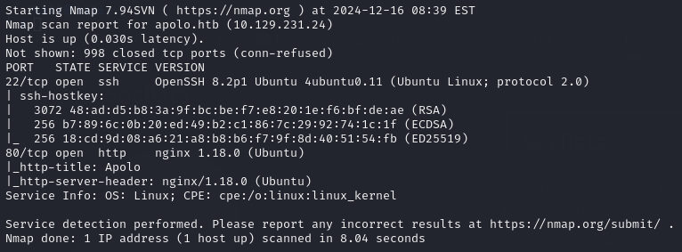
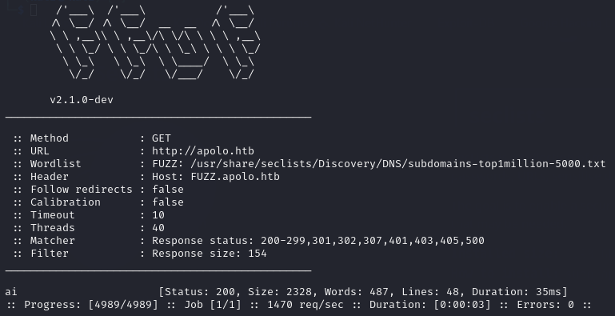
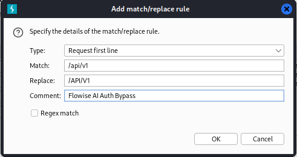
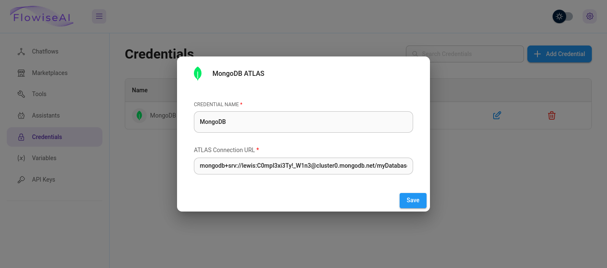
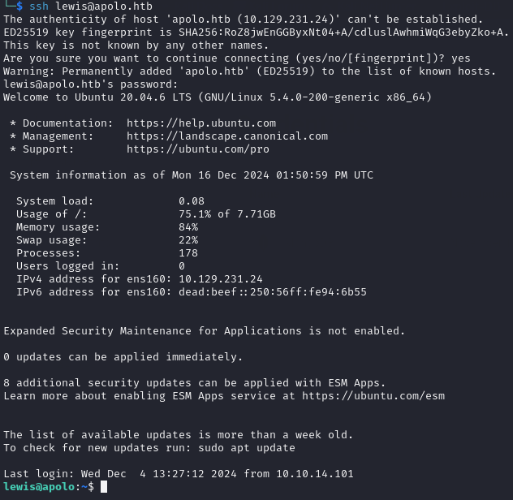
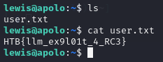
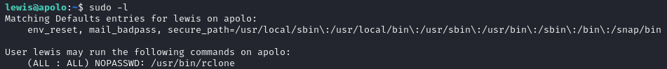
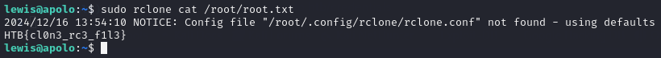

<h1><ins>HackTheBox University CTF 2024: Apolo Writeup</ins></h1>

**Date:** 18/12/2024\
**Author:** [acfirthh](https://github.com/acfirthh)

**Challenge Name:** Apolo\
**Difficulty:** Very Easy

## Reconaissance
### NMAP Scan

The initial NMAP scan showed me that there were 2 ports open, port 22 (SSH) and port 80 (HTTP). The website running on port 80 had the domain name **apolo.htb**.

> Add **apolo.htb** to the /etc/hosts file

### FFUF Subdomain Scanning

I've gotten into the habbit of immediately scanning for subdomains after finding the root domain, so using **FFUF** I ran a scan and it discovered **ai.apolo.htb**.

> Add **ai.apolo.htb** to the /etc/hosts file

## Initial Compromise
Upon an initial inspection of the **apolo.htb** site, I didn't see anything particularly interesting. But browsing to **ai.apolo.htb** I noticed immediately that it was running **"Flowise AI"**.

I looked up any exploits for **Flowise AI** and found one for authentication bypass. The exploitation was very easy, when you first view the webpage it sends requests to an API endpoint `/api/v1/<endpoint>` to check if you are authenticated, if not, it will display a login form and you cannot interact with the website behind the form without logging in with valid credentials. However, by capitalising the endpoint strings, it bypasses the authentication and assumes you are already authenticated.

> (`/api/v1` becomes `/API/V1`)

By adding a simple **"Match and Replace"** rule in **BurpSuite's** proxy settings, you can automate changing the API endpoint strings without having to intercept every request and change it manually.

Once setting the rule, I simply refreshed the page and **BurpSuite** handled the replacing for me so no login form popped up.

Now that I was able to interact with the website, I noticed a **"Credentials"** section in the menu at the side of the page, clicking on it, there was a section for **MongoDB** credentials, I opened it and was met with the username `lewis` and a password.

> **Lewis' Credentials: lewis / C0mpl3xi3Ty!_W1n3**

Remembering that SSH was open on the NMAP scan, I tested the credentials on SSH and they worked! I was now successfully logged in as `lewis` on the target and I was able to get the user flag in his home directory!

> The flag hinted to **RCE** and there was an **RCE** exploit for **Flowise AI** however I didn't need to use it as there were exposed credentials, which is much simpler.

## Getting the root flag
Running `sudo -l` to see `lewis'` sudo permissions, I noticed that I could run the `rclone` tool without a password using sudo.

> "Rclone is a versatile tool to sync, backup, restore, migrate, mount and analyse files on cloud storage."

Knowing that the root flag is stored in `/root/root.txt` I simply ran the command:\
`sudo rclone cat /root/root.txt`

This read the contents of the root flag and presented them to me.

> Again, the flag hints at **RCE** again, which I did not do as it's much simpler to just read the contents of the flag file.

Although this didn't give me root permissions, I could have also used **rclone** to read the contents of the `/etc/shadow` file which would contain the hash of the root user and any other users on the machine. With the hash, if the root user had a particularly weak password, it would have been trivial to crack the hash and then login as root.

## Final Words
This machine was ranked as **"Very Easy"** and I must admit, it was. But it was a particularly fun and satisfying machine to complete.