<h1><ins>TryHackMe: Mountaineer Writeup</ins></h1>

**Date:** 21/10/2024\
**Author:** [acfirthh](https://github.com/acfirthh)

**Machine Name:** Mountaineer\
**Difficulty:** Hard\
**Link to Machine:** [TryHackMe - Mountaineer (Hard)](https://tryhackme.com/r/room/mountaineerlinux) 

### Tools Used:
- NMAP
- Gobuster
- SearchSploit
- SQLMap
- msfconsole
- keepass2john
- JohnTheRipper

## Summary
**Mountaineer** is a **Hard** machine on **TryHackMe** that starts with discovering a **WordPress** site, that uses vulnerable plugins, hosted on an **Nginx 1.18.0** server.\
The **Nginx** server is misconfigured, allowing read access to **Nginx** configuration files via **Local File Inclusion (LFI)**.\
Reading the configuration files leads to a subdomain hosting **RoundCube Webmail**.\
Viewing emails within **RoundCube** there is a password for a user which allows me to exploit an **Authenticated Remote Code Execution (RCE)** vulnerability within one of the **WordPress** plugins.

## Recon
### NMAP Scan:
```
Nmap scan report for 10.10.130.135
Host is up (0.029s latency).
Not shown: 65533 filtered tcp ports (no-response)
PORT   STATE SERVICE VERSION
22/tcp open  ssh     OpenSSH 8.9p1 Ubuntu 3ubuntu0.6 (Ubuntu Linux; protocol 2.0)
| ssh-hostkey: 
|   256 86:09:80:28:d4:ec:f1:f9:bc:a3:f7:bb:cc:0f:68:90 (ECDSA)
|_  256 82:5a:2d:0c:77:83:7c:ea:ae:49:37:db:03:5a:03:08 (ED25519)
80/tcp open  http    nginx 1.18.0 (Ubuntu)
|_http-title: Welcome to nginx!
|_http-server-header: nginx/1.18.0 (Ubuntu)
Service Info: OS: Linux; CPE: cpe:/o:linux:linux_kernel

Service detection performed. Please report any incorrect results at https://nmap.org/submit/ .
Nmap done: 1 IP address (1 host up) scanned in 41.14 seconds
```
A rather quick NMAP scan returned that there were only 2 ports open, port 22 (SSH) and port 80 (HTTP - Nginx 1.18.0).

Visiting the webserver on port 80, I was met with a default page for an **Nginx** server.

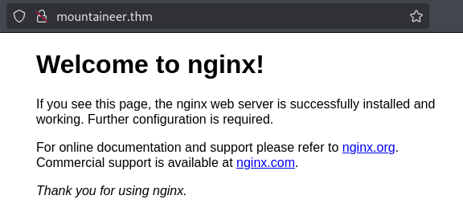

### Gobuster Scan:
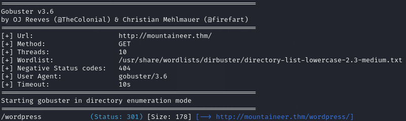

A Gobuster scan on the webserver shows a directory `/wordpress`.\
Browsing to the **WordPress** directory, I saw a seemingly broken webpage, with no CSS loading to make the page look as it was supposed to.\
Hovering over a link on the webpage, I noticed it was a link to `mountaineer.thm`.

Adding `mountaineer.thm` to the `/etc/hosts` file and refreshing the webpage, it loaded correctly.

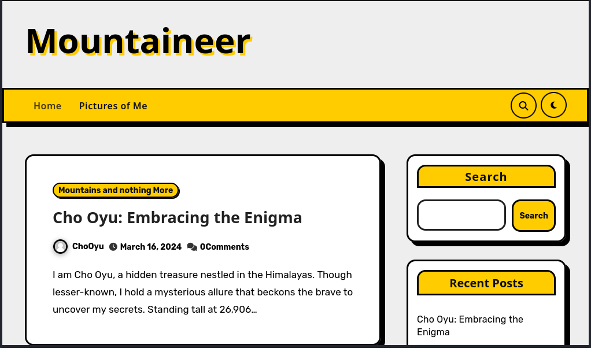

### WordPress Gobuster Scan:
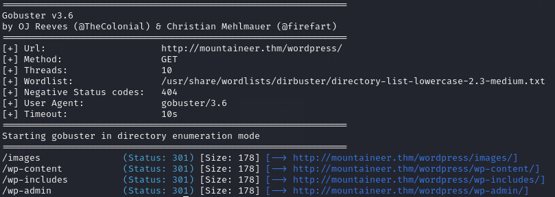

### WPScan:
Using **WPScan** on the **WordPress** site, I found that there was a plugin installed named **Modern Events Calendar** which had numerous vulnerabilities.

#### Modern Events Calendar Vulnerabilities:
- Event Export (Unauthenticated) - v5.16.2
- SQL Injection (Unauthenticated) - v6.1
- Remote Code Execution (Authenticated) - v5.16.2

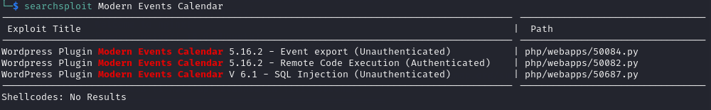

I initially thought that I would be able to extract the password hashes through the SQL injection vulnerability, crack them, and then use the password to exploit the RCE vulnerability.

I was able to extract the usernames and hashes:

```
admin:$P$BV.Ti3d.cRhWdsEkDtiloJB9JGxEPG0
Everest:$P$BZQ0YZAGs5N/7CuPTv6kaxNkgBUtmE1
MontBlanc:$P$B5XtOtT1tfaQx.ZvNQIGAHw0XN30xh1
ChoOyu:$P$B8LM6vinNP2PP9S3dVRUNDDyJdgYAl/
K2:$P$BKBvlxfa9Wh9ZSblTYiYx0Ea00pNle0
```

However, none of the hashes were crackable using multiple wordlists including **rockyou.txt**.

I then exported the events, thinking that there would be some useful information within them.\
But unfortunately not...
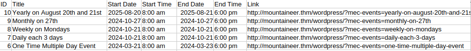

## Nginx LFI Exploitation
After some more research, I was able to find [this](https://book.hacktricks.xyz/network-services-pentesting/pentesting-web/nginx) page from **HackTricks** about Nginx misconfiguration vulnerabilities.

I came accross this section about LFI through **Alias Misconfiguration**:

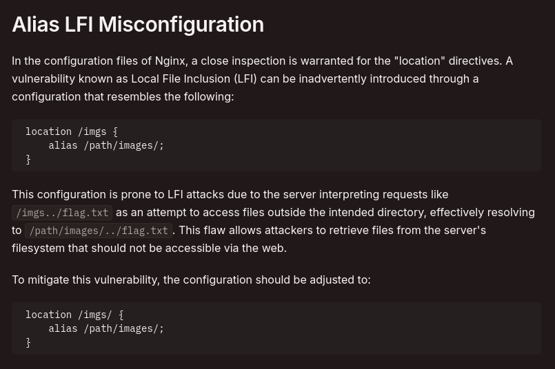

Looking back at the **Gobuster** scan I noticed an `/images` directory. Using **curl** I attempted to exploit the LFI vulnerability:\
`curl http://mountaineer.thm/wordpress/images../etc/passwd`

Success! I got the contents of `/etc/passwd`
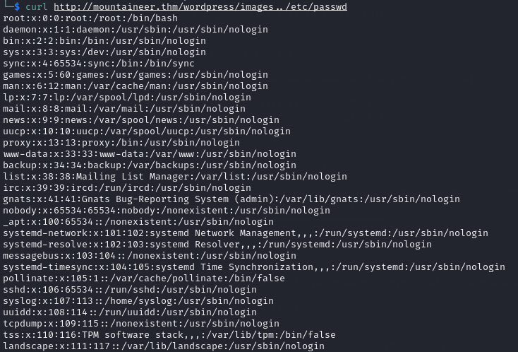

Once I knew I could exploit the **Alias Misconfiguration** for **LFI**, I read the Nginx configuration file `/etc/nginx/sites-enabled/default` to see if there were any other subdomains.

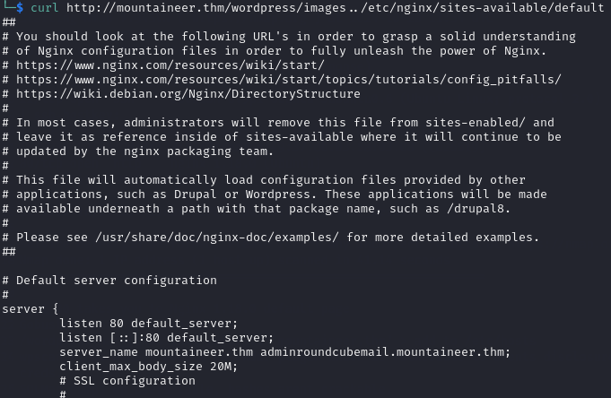

This revealed that there is another subdomain: `adminroundcubemail.mountaineer.thm`.

Adding this to my `/etc/hosts` file and then visiting it in a browser, I was met with the login page to **RoundCube webmail**.

> Roundcube is an open-source web-based IMAP email client.

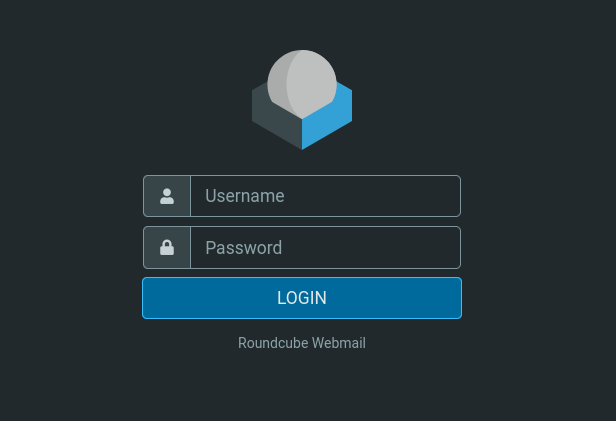

Re-visiting the **WordPress** site and looking through the posts for usernames, I made a list of usernames:
```
admin
Everest
MontBlanc
ChoOyu
```
I also noticed that the admin user mentioned another user `K2` in two posts, although they never made any posts themselves.


## Initial Foothold
With a list of usernames, I attempted to login to **RoundCube** using common passwords including the username as the password. After testing a few username and password combinations, I eventually got the password for the username `k2`!

### K2's Mailbox:
In K2's mailbox, there were two emails.\
The first one being from the user **lhotse**, with the subject **"Security Risk"**, mentioning that they had recieved some information that passwords had been shared in previous emails to **K2**.

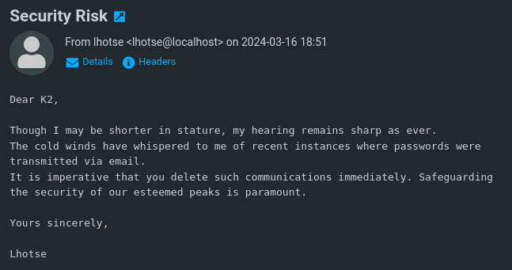

Knowing this new information, I checked the second email from the user **nanga**, and to no surprise there was a password.

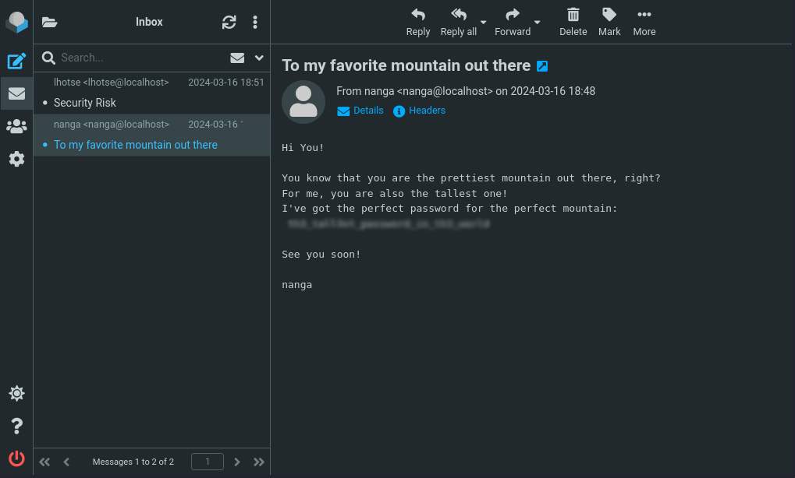

Testing these credentials, `k2:[REDACTED]` on the **WordPress** page, I was successfully able to login. Which meant I could then exploit the **RCE** vulnerability in the **Modern Events Calendar WordPress Plugin**. 

### Getting a Shell (www-data):
Utilising `msfconsole` to exploit the **RCE** vulnerability I was able to get a shell as **www-data**.

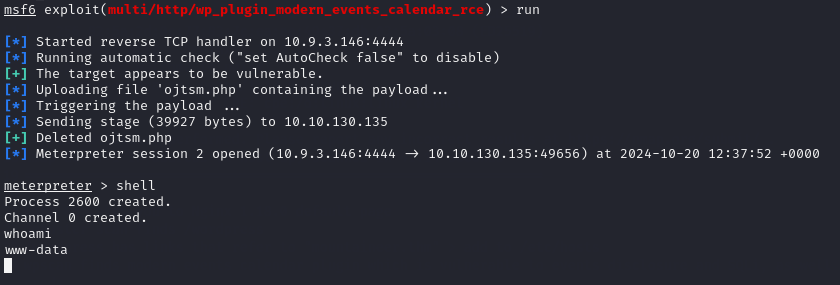

## Priv-Esc to k2
Privilege escalation to the user **k2** was as simple as guessing that they happened use the same password as they used to login to **RoundCube** and it was successful.

## Lateral Priv-Esc from k2 to kangchenjunga
Running the command `ls -lah /home/*` I was able to view the contents of all of the users home directories:

```
/home/annapurna:
total 8.0K
drwxr-xr-x  2 root root 4.0K Apr  6  2024 .
drwxr-xr-x 11 root root 4.0K Mar 16  2024 ..
lrwxrwxrwx  1 root root    9 Apr  6  2024 .bash_history -> /dev/null

/home/everest:
total 8.0K
drwxr-xr-x  2 root root 4.0K Apr  6  2024 .
drwxr-xr-x 11 root root 4.0K Mar 16  2024 ..
lrwxrwxrwx  1 root root    9 Apr  6  2024 .bash_history -> /dev/null

/home/k2:
total 12K
drwxr-xr-x  3 k2   k2   4.0K Apr  6  2024 .
drwxr-xr-x 11 root root 4.0K Mar 16  2024 ..
lrwxrwxrwx  1 root root    9 Apr  6  2024 .bash_history -> /dev/null
drwx------  3 k2   k2   4.0K Apr  6  2024 mail

/home/kangchenjunga:
total 20K
drwxr-xr-x  2 root          root          4.0K Mar 18  2024 .
drwxr-xr-x 11 root          root          4.0K Mar 16  2024 ..
-rw-r-----  1 kangchenjunga kangchenjunga  303 Mar 18  2024 .bash_history
-rw-r-----  1 root          kangchenjunga   33 Mar 16  2024 local.txt
-rw-r-----  1 kangchenjunga kangchenjunga  216 Mar 16  2024 mynotes.txt

/home/lhotse:
total 16K
drwxr-xr-x  3 lhotse lhotse 4.0K Apr  6  2024 .
drwxr-xr-x 11 root   root   4.0K Mar 16  2024 ..
lrwxrwxrwx  1 root   root      9 Apr  6  2024 .bash_history -> /dev/null
-rwxrwxrwx  1 lhotse lhotse 2.3K Apr  6  2024 Backup.kdbx
drwx------  3 lhotse lhotse 4.0K Mar 16  2024 mail

/home/makalu:
total 8.0K
drwxr-xr-x  2 root root 4.0K Apr  6  2024 .
drwxr-xr-x 11 root root 4.0K Mar 16  2024 ..
lrwxrwxrwx  1 root root    9 Apr  6  2024 .bash_history -> /dev/null

/home/manaslu:
total 8.0K
drwxr-xr-x  2 root root 4.0K Apr  6  2024 .
drwxr-xr-x 11 root root 4.0K Mar 16  2024 ..
lrwxrwxrwx  1 root root    9 Apr  6  2024 .bash_history -> /dev/null

/home/nanga:
total 16K
drwxr-xr-x  3 nanga nanga 4.0K Apr  6  2024 .
drwxr-xr-x 11 root  root  4.0K Mar 16  2024 ..
lrwxrwxrwx  1 root  root     9 Apr  6  2024 .bash_history -> /dev/null
-rw-rw-r--  1 nanga nanga  335 Mar 18  2024 ToDo.txt
drwx------  3 nanga nanga 4.0K Mar 16  2024 mail
```
I noticed that there was a file named `Backup.kdbx` in **lhotse's** home directory with read, write, and execute privileges.\
I downloaded it to my local machine using the meterpreter shell function `download <remote_file_location> <local_file_location>`.

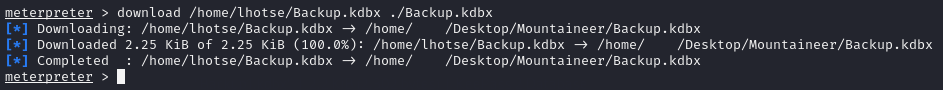

The file `Backup.kdbx` is a **KeePass** password manager file which needs a master password to decrypt and view the stored passwords.

Searching about a bit more I found a **sent** email from **k2** to **lhotse** containing some personal information about **lhotse**.

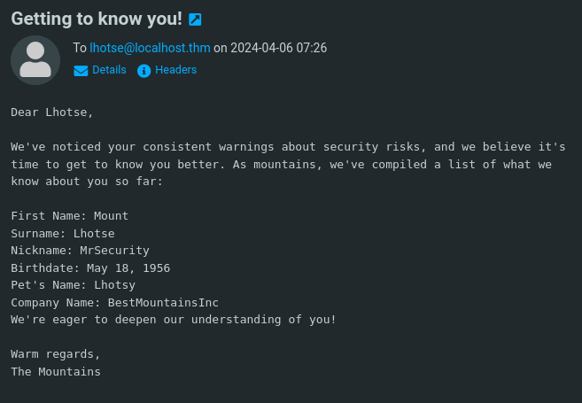

The way that the information is laid out reminded me of a password profiling tool named `cupp` which is used to create a list of possible password combinations from given information.

Running the command `cupp -i`, to start the program in interactive mode, and filling in the information I have about **lhotse** generated a password list.

### Extracting and Cracking the KeePass Hash:
Running the command `keepass2john Backup.kdbx > keepass_hash.txt` extracts the password hash from the **KeePass** file in a format that **JohnTheRipper** can understand.

Once I had the **KeePass** hash and the password list, I ran the command: `john keepass_hash.txt --wordlist=<password list>` and waited for it to finish.\
It successfully found the password for the **KeePass** file.

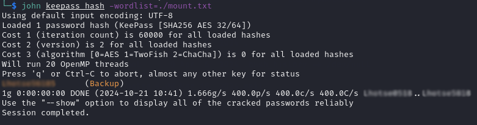

### Decrypting the KeePass file and Viewing the Passwords:
Opening up the **KeePass** file with **KeePassXC** software on my machine and entering the password cracked by **JohnTheRipper**, I was able to view the stored passwords.

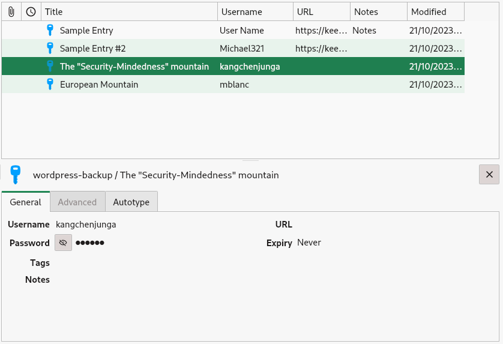

Within the **KeePass** file there was a password for the user **kangchenjunga**.\
Using this password I was able to change user to **kangchenjunga**.

## Priv-Esc to root
Changing directory into **kangchenjunga's** home directory, I could read a file named `mynotes.txt` that referenced the user **root** using their account.\
Knowing this information, and spotting that the file `.bash_history` was not redirected to `/dev/null` like the other users is, I read the contents of the `.bash_history` file to see if there was any useful information in there that the **root** user may have left behind whilst using **kangchenjunga's** account.

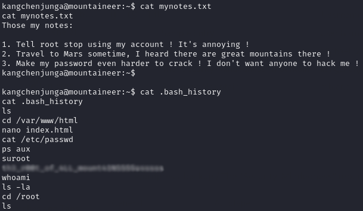

There it is, the **root** user's password.\
Using this password, I was able to become **root** and get the final flag for the CTF.
